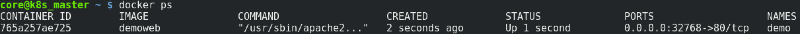
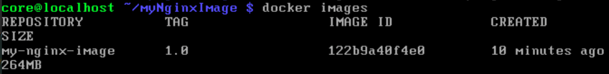

# 容器操作系统 CoreOS 和 Docker 基础学习

> 容器在今天的IT环境里，已经是必不可少的一部分了，所以为容器量身定做的操作系统应运而生了，接下来要讲的就是容器的操作系统 CoreOS 。  

## catalog

<!-- @import "[TOC]" {cmd="toc" depthFrom=1 depthTo=6 orderedList=false} -->

<!-- code_chunk_output -->

- [容器操作系统 CoreOS 和 Docker 基础学习](#%e5%ae%b9%e5%99%a8%e6%93%8d%e4%bd%9c%e7%b3%bb%e7%bb%9f-coreos-%e5%92%8c-docker-%e5%9f%ba%e7%a1%80%e5%ad%a6%e4%b9%a0)
  - [catalog](#catalog)
  - [为什么要用CoreOS（catalog）](#%e4%b8%ba%e4%bb%80%e4%b9%88%e8%a6%81%e7%94%a8coreoscatalog)
  - [实验-PXE安装CoreOS（catalog）](#%e5%ae%9e%e9%aa%8c-pxe%e5%ae%89%e8%a3%85coreoscatalog)
  - [启动过程](#%e5%90%af%e5%8a%a8%e8%bf%87%e7%a8%8b)
  - [讲解ignition](#%e8%ae%b2%e8%a7%a3ignition)
  - [etcd介绍](#etcd%e4%bb%8b%e7%bb%8d)
  - [实验-启动容器测试overlay网络是否打通（catalog）](#%e5%ae%9e%e9%aa%8c-%e5%90%af%e5%8a%a8%e5%ae%b9%e5%99%a8%e6%b5%8b%e8%af%95overlay%e7%bd%91%e7%bb%9c%e6%98%af%e5%90%a6%e6%89%93%e9%80%9acatalog)
    - [启动容器](#%e5%90%af%e5%8a%a8%e5%ae%b9%e5%99%a8)
    - [etcdctl工具的简单使用](#etcdctl%e5%b7%a5%e5%85%b7%e7%9a%84%e7%ae%80%e5%8d%95%e4%bd%bf%e7%94%a8)
    - [新的容器引擎rkt介绍](#%e6%96%b0%e7%9a%84%e5%ae%b9%e5%99%a8%e5%bc%95%e6%93%8erkt%e4%bb%8b%e7%bb%8d)
    - [总结](#%e6%80%bb%e7%bb%93)
  - [docker基础（catalog）](#docker%e5%9f%ba%e7%a1%80catalog)
    - [docker的介绍](#docker%e7%9a%84%e4%bb%8b%e7%bb%8d)
    - [镜像层](#%e9%95%9c%e5%83%8f%e5%b1%82)
    - [网络模型CNM、CNI](#%e7%bd%91%e7%bb%9c%e6%a8%a1%e5%9e%8bcnmcni)
  - [实验-docker基本操作（catalog）](#%e5%ae%9e%e9%aa%8c-docker%e5%9f%ba%e6%9c%ac%e6%93%8d%e4%bd%9ccatalog)

<!-- /code_chunk_output -->

## 为什么要用CoreOS（[catalog](#catalog)）

CoreOS 首先在内存的使用量上要比传统的 Linux 操作系统少35%左右，它是为容器量身定做的，系统自带容器引擎 Docker 、 rkt ，它可以在你的裸机环境上运行，也可以在我们的运行环境上运行，它的启动速度特别快，有9个磁盘分区，文件系统分区占2个（A-分区3，B-分区4），每次从其中的一个系统分区中启动，更新的内容会写入另一个系统分区，下次启动运行新的系统分区。它会定时的自动更新防止漏洞，此功能可以被屏蔽


## 实验-PXE安装CoreOS（[catalog](#catalog)）

实验拓扑图如下， pxe 服务器通过 br1 的地址段 10.0.0.0/24 来提供服务的，两台CoreOS通过br1网桥安装系统，两台 CoreOS 中除了有第一张网卡外，第二张网卡（ eth1 ）是提供容器之间通信的，它连接到主机 br3 网桥。  


> 实验目的：创建2台 CoreOS ，并用 flannel 将 overlay 的网络打通，并在2台 CoreOS 上运行2个容器后互相 ping 对方，检查是否可以彼此访问。  

创建第一个节点： 我们实验环境都是基于kvm的虚拟机，所以接下去需要使用libvirt去kvm中创建第一台CoreOS。

```shell
## 在主机上运行， 创建一个磁盘
qemu-img create -f qcow2 -o size=20G /home/vms/coreos_node1.qcow2

## 在主机上运行， 创建一台虚拟机
virt-install --name core_master --ram 4096 --disk /home/vms/coreos_node1.qcow2,format=qcow2,bus=sata --vcpus 1 --network bridge=br1,model=virtio,mac=d0:00:67:13:0d:00 --network bridge=br3 --vnc --noautoconsole --pxe
```

在主机上终端输入命令 virt-manager 打开 qemu 图形化界面工具，你会看到如下，然后点击 core_master ，然后点击 Open  


```shell
# 在host连接 coreos ，注意要使用 key
ssh -i ~/coreos_key core@10.0.0.20

# 现在的系统只是运行在内存当中，我们需要把它 boot loader 安装到硬盘设备上，在你新建的 coreos 主机上运行,然后等待完成
coreos-install -d /dev/sda -b http://10.0.0.10/coreos   -i coreos_master_update.json

# 你会看到一些failed的错误，请忽略。完成后你会看到
# Success! CoreOS Container Linux stable 1632.2.1 is installed on /dev/sda
```


```shell
# 在你新建的coreos主机上运行重启命令，请注意virt manager可能遇见bug
# 不会帮你自动重启，只是帮你关机，请从virt manager中手动点击启动即可。
sudo reboot
# 你会看到有些job会花不少的时间，那是在等待dhcp服务为它分配ip地址。
# 完成后会发现网卡的地址都配置好了，主机名也配置好了。
```


```shell
# 在你的host上运行,创建另一个磁盘
root@host ~ $  qemu-img create -f qcow2 -o  size=20G  /home/vms/coreos_node2.qcow2
# 在你的host上运行,创建第二台coreos虚拟机
root@host ~ $  virt-install --name core_slave1 --ram 4096 --disk /home/vms/coreos_node2.qcow2,format=qcow2,bus=sata --vcpus 1 --network bridge=br1,model=virtio,mac=d0:00:67:13:0d:01 --network bridge=br3 --vnc --noautoconsole --pxe
# 安装到本地磁盘设备
root@host ~ $  ssh -i ~/coreos_key core@10.0.0.30
core@localhost ~ $ sudo coreos-install -d /dev/sda -b http://10.0.0.10/coreos -i coreos_slave1.json
# 按照之前的步骤启动
```

## 启动过程

为了更好的理解coreos的使用，我们需要讲解coreos的启动过程。


## 讲解ignition

ignition就是coreos启动的配置文件，初衷是为了coreos在启动时执行脚本，有点像早起的 kick start 脚本，ignition 一般是以 json 的格式出现的，不管时在云环境或者裸机中部署 coreos，都会非常依赖 ignition 配置文件。

打开此配置文件 `vim /root/coreos_master_update.json`


- ignition -- 定义了 ignition 的版本，一般是随着coreos操作系统的发行版而更新的。
- networkd -- 定义了网络的配置，其中 units 就是代表网卡，如果有多张网卡的话，可以在units里定义多个 `[{ name:”eth1” ,otherconfig:”” },{ name:”eth2” ,otherconfig:””}]`
- storage -- 定义存储设备的操作以及将文件写入本地磁盘，比如下载文件，或者格式化底层设备比如分区并设置磁盘的文件格式（mkfs）等。
- systemd -- 定义了覆盖systemd启动文件(drop in)，如：coreos 自带的 Docker 网络使用的是bridge模式，我们可以填写 systemd 让 coreos 启动时覆盖 Docker 引擎的 systemd 配置文件，将默认的网络从 bridge 模式改为 host 。
- passwd -- 定义了在安装过程当中需要创建什么用户，并且定义了该用户访问时的公钥。
打开此配置文件 `vim /root/coreos_master_update.json`

## etcd介绍

etcd是一个开源的分布式的键值对（key value）数据库,他的优点是高并发（10,000写入/秒）、TLS安全访问（https）、分布式（Raft consensusn算法），etcd属于coreos下的一个[子项目](https://github.com/coreos/etcd)，并被很多项目所使用 coreos、kubernetes、flannel 等。


> 在k8s中，每个etcd的集群节点都是以一个pod出现的，他们之间通过相互同步数据来保持集群的健康，每个pod的数据存储又依赖于那个节点的存储设备，etcd分别负责将wal日志文件和数据写到当前节点的存储设备上，所以日志文件目录所在的存储设备的io对etcd集群的性能有着至关重要的作用，我们总结下企业级中的使用需要注意的事项:
>
> * 磁盘的 IO -- 及诶单上的磁盘IO越高，etcd的集群性能越好。  
> * 存储位置 -- 不要把不同节点上etcd的pod的存储设备放到同一个存储后端中，比如 (ceph)。  

## 实验-启动容器测试overlay网络是否打通（[catalog](#catalog)）

> 实验目的：检测两台 coreos 中启动的容器是否可以彼此访问，并简单的了解如何使用etcdctl工具来读取和设置etcd中的数据。

### 启动容器

```shell
# 删除之前的ssh记录，忽略arp欺诈防止机制。
root@host ~ $  rm -f .ssh/known_hosts

# 分别打开2个命令行窗口，分别输入以下命令:
root@host ~ $  ssh -i  ~/coreos_key core@10.0.0.20
root@host ~ $  ssh -i ~/coreos_key core@10.0.0.30

# 分别打开2个命令行窗口，分别输入以下命令:
core@k8s_master ~ $ docker load -i web.tar
core@k8s_slave1 ~ $ docker load -i web.tar
core@k8s_master ~ $ docker tag 7cc7ee0225c2 demoweb:latest
core@k8s_slave1 ~ $ docker tag 7cc7ee0225c2 demoweb:latest

# 分别打开2个命令行窗口，分别输入以下命令来启动2个容器
core@k8s_master ~ $ docker run --name demo -d -P demoweb:latest
core@k8s_slave1 ~ $ docker run --name demo -d -P demoweb:latest

# 连接容器，自动进入容器的bash命令行
core@k8s_master ~ $ docker exec -it demo /bin/bash
core@k8s_slave1 ~ $ docker exec -it demo /bin/bash

# 在容器命令行中首先查看ip地址
root@32c459e506f9 ~ $ ip a
root@79d8050be42a ~ $ ip a
```


```shell
# 在容器命令行中互相ping对方,应该互相都能ping通。
root@32c459e506f9 ~ $ ping 10.1.5.2
root@79d8050be42a ~ $ ping 10.1.37.2

# 退出容器
root@32c459e506f9 ~ $ exit
root@79d8050be42a ~ $ exit
```

### etcdctl工具的简单使用

我们之前在容器中看到的网络10.1.x.x就是coreos安装时我们在ignition中为它设置的，coreos会自动让Docker使用flannel定义的网络，并使用flannel作为网络插件，但是这个地址信息是保存在etcd中的，我们可以用etcdctl工具来查看:

```shell
# 设置etcd endpoint
core@k8s_master ~ $ export ETCDCTL_ENDPOINTS=http://10.0.0.20:2379
core@k8s_master ~ $ etcdctl get /coreos.com/network/config
```


```shell
# 设置一个值
core@k8s_master ~ $ etcdctl set /firstkey trystack
# 然后查看这个值,应该打印出trystack
core@k8s_master ~ $ etcdctl get /firstkey
```

### 新的容器引擎rkt介绍

rkt 是一个运行容器的引擎，它的作用和 Docker 基本一样，但是它的一些安全和性能的特性非常有趣，比如它除了可以运行Docker镜像，也可以运行 ACI（Application Container Image），它有以下几大特性

- Pod 内置 -- rkt运行的最小单元是 pod （之后解释）
- 资源 -- 使用更少的资源来运行 rkt 引擎
- 安全 -- 它支持虚拟机级别的安全机制（和 KVM 集成）、支持 selinux 等，在启动容器不需要 root 权限来运行。
- rkt vs Docker
  - 我们看到下图中第一张图是rkt，第二张图图是Docker(1.11+)，他们启动一个容器的时候经过的步骤显然rkt更加轻量化，需要的步骤也更少，当然启动容器的速度更快。
    图一
    
    图二
    
- production ready -- coreos 官方宣布 rkt 已经是生产级别的应用了，完全可以上生产，但是目前因为诞生的时间和大家对它的认知有限，在生产环境下用的还是比较少，当然我们 的 k8s 完全支持 rkt 作为底层的容器引擎，除此之外 coreos 当然用rkt作为容器的引擎，还有不少企业也在用 rkt 做为容器引擎，详细可以查看 [https://coreos.com/rkt/docs/latest/production-users.html](https://coreos.com/rkt/docs/latest/production-users.html)。

### 总结

我们之前都在讨论关于 coreos 的一套生态环境包括 etcd、flannel、rkt 等，你可以在 aws 上看到不少coreos的应用场景，现在 coreos 已经被 red hat 收购了，红帽对 coreos 的发展会起到什么影响，我们现在还不得而知，不过在被收购之前 coreos 已经被很多人和公司所认可。

## docker基础（[catalog](#catalog)）

在开始讲解k8s之前，有必要将Docker的基础知识跟大家灌输一下，虽然k8s尽可能屏蔽了我们对于底层容器的直接操作，类似于 OpenStack 屏蔽了我们对 hypervisor（ 默认kvm ）的直接操作，但是了解 Docker 有助于我们更好的解决问题。

### docker的介绍

Docker 是在 Linux 主机上运行容器的引擎，或者说是工具，它通过下载镜像，然后在Linux主机上借助于主机的内核 ( kernel )、namespace、cgroup 来运行和管理容器，容器在启动速度方面比起虚拟机有明显的优势，当然容器也有自己的劣势，比如安全机制方面的缺陷，所以现在出现很多轻量级的虚拟机，他们兼顾速度和安全性，当然我们课程中还是关注 Docker，毕竟 k8s 的底层的容器引擎还是 Docker 居多。

- Linux namespace -- 提供资源隔离，它包括：Process Tree ( PID namespace ) 的隔离、 Mounts ( MNT Namespace ) 存储设备的隔离、network ( Net Namespace ) 网络的隔离、Users/Uid ( user Namespace ) 用户的隔离、Hostnames ( UTS Namespace ) 主机名的隔离。
- Cgroup -- 提供进程级别的资源控制，比如 cpu、内存的使用量。
- Docker CE -- Docker Community Edition 我们简称社区版，就是最早的 docker 引擎，现在因为 Docker 要商业化，所以诞生了2个截然不同的版本，其中一个就是 Docker CE ，还有一个就是 Docker EE，我们在后面会介绍，需要注意的是2个版本在核心功能上是一样的，只是你使用的时候需要自己动手去做所有的事。
- Docker EE -- Docker Enterprise Edition 我们简称企业版，也是从 Docker CE 繁衍过来的，本身的核心功能是一样的，Docker EE 提供很多官方的服务，比如官方的技术支持服务、镜像的安全扫描服务等。

### 镜像层

Docker容器的启动依赖于镜像，但我们这里的镜像并非虚拟化中的镜像，Docker 比起最早出现的LXC对磁盘的用量和性能方面都有了很大的提高，它借助于现代操作系统的文件系统的特性，比如 AUFS ( Ubuntu 的系统的文件系统早期是 union file system ，可以将多个文件夹合并为一个大文件夹并设置读写权限)，Layering ( 分层 ) 、Cache ( 缓存 ) 、copy-on-write 等功能快速的启动和操作容器，镜像存储方式大大取决于操作系统的文件系统格式，我们来看下有哪些:

- OverlayFS -- 比较有名的操作系统就是 coreos(overlay2)
- AUFS -- Ubuntu 使用的文件系统
- device-map -- Red hat 操作系统使用(RHEL/Centos)
- brtfs -- 下一代红帽操作系统的文件系统
- ZFS -- 下一代 Ubuntu 操作系统的文件系统

Docker 下载的镜像都是只读的，一个镜像中有一个或者多个镜像layer(层)，每一个layer都是依赖于下一层layer的，镜像中所有layer都可以在 docker file 中定义，并且保存在下载该镜像的主机上的特定位置，根据操作系统的文件系统会有不同 ( OverlayFS、AUFS、brtfs、ZFS、device-map ) ，启动容器时 Docker 会先加载镜像，并在镜像上添加一层container layer(容器层)以供用户写入数据，所有的更改只需要保存 container layer 即可，所以容器的启动特别的快，因为他的底层镜像是不变的直接引用或者映射即可，最后准备容器的 rootfs 和 chroot。


### 网络模型CNM、CNI

K8s对容器编排的最终目的是要让容器对外提供服务，要对外提供服务网络是必不可少的，所以k8s就依赖于容器的网络，接下来的内容我们就来了解一下容器的网络，当然我们使用的是 Docker ，所以偏重于 Docker。

在开始前同学需要了解到 Docker 的网络很大程度上依赖 Linux 网络，比如 iptables、Linux bridge 等。我们需要了解所有的网络数据通过底层的物理接口接收或者发送都是要经过一系列的处理，或者直接经过内核的处理(kernel)，更准确的说是 Linux kernel stack ，它处理OSI模型中的数据链路层(Data Link)、网络层(Network )、传输层(Transport)，我们的 iptables 和 Linux bridge 也是由内核来做处理的。

现在Docker的网络模型有两种方法，一种是来自 Docker 的 CNM ，另一种是早期来自 coreos 社区的 CNI，现在已经被纳入到 CNCF 组织下了。

- CNM -- container network model 是 Docker 发明的容器的网络模型，libnetwork 就是对这个模型的一种具体的实现，它可以和很多项目或者说插件集成，比如 project calico、Cisco Contiv、Kuryr、OVN、VMware、Weave 等。
    
- CNI -- container network interface 最初是来自 coreos 社区的规范或者说是模型，现在已经是一个cncf下的项目，CNI阵营这边有很多使用者必入 Apache Mesos、Cloud Foundry、Kubernetes、Kurma、rkt、Contiv Networking、Project Calico、Flannel 和 Weave，其中 Flannel 是我们课程当中主要使用的网络模型。您可以查看 [https://github.com/containernetworking/cni](https://github.com/containernetworking/cni) 来了解更多cni的知识。


容器的网络模式有以下这些:

- host mode -- 主机模式容器，直接使用主机的网络，简单的讲你连接到容器里通过ip a命令看到的是外面主机的网络信息，我们不做深入讨论，因为这种模式基本不用了。
- bridge mode -- 或者又称为NAT模式，所有容器出去的流量（egress）和返回的流量都是通过NAT的（SNAT、DNAT），但是从主机外部无法直接访问到该容器的ip地址和端口，只能访问主机的 ip 地址和映射的端口，除非设置 iptables 的规则
    
- overlay mode -- 主要用于多个 swam 守护进程（daemons）之间的通信，也可以用于 swam 和容器之间通信，这也不是我们讨论的重点。
- macvlan mode -- 直接为容器的网卡绑定 ip 地址，有点像虚拟化中的 bridge 模式，容器直接拿到了主机网段的地址并且有 mac 地址，就等于在主机的网络中多了一台物理的设备，这种一般使用在对网络性能要求高的情况下。
- plugin mode（CNI） -- 插件模式也是我们主要关注的模式，容器的网络可以通过各种第三方的插件集成到容器当中，比如 flannel、cailco、ovs 等。他们都是根据 Docker 的网络模型 CNI（container network interface）来构建的。

    

## 实验-docker基本操作（[catalog](#catalog)）

接下去会让大家动手做一些常用的命令操作，比如：下载镜像、运行容器、挂载一个volume、为一个镜像打标签、从docker file编译一个镜像等。

- docker search -- 我们在运行容器前，要先找到我们需要的镜像，比如我们需要启动一个postgres数据库的容器，那么我们首先要找到它的镜像，所以你可以使用docker search [镜像名称] 来查找你想要的镜像。

    ```shell
    #连接coreos
    root@host ~ $  ssh -i coreos_key core@10.0.0.20

    #查找镜像busybox
    core@k8s_master ~ $ docker search busybox

    #busybox预装了很多工具，很多镜像中没有常用的命令行。
    #注意STARS列是大家对镜像的评价，OFFICIAL代表是否是官方的
    ```

- docker pull -- 我们刚才查找了 busybox，现在我们要通过查找到的内容来下载该镜像。

    ```shell
    # 由于某些不可描述的原因，你可能无法下载这个镜像，我们可以不用等待
    # 因为我们之后不会使用这个镜像,你可以按crtl+c键来停止进程
    core@k8s_master ~ $ docker pull busybox
    ```

- docker stop -- 我们可以通过 `docker stop [容器名/id]` 来停止容器的运行，在前几章的练习中我们启动了一个容器叫做 demo ,我们现在来停止这个容器。

    ```shell
    core@k8s_master ~ $ docker stop demo
    # 查看所有的容器包括已经停止的，需要添加-a参数，否则只显示正在运行的容器
    core@k8s_master ~ $ docker ps -a
    ```

    

- docker start -- 我们刚才停止了容器 demo ，现在我们需要重新启动这个容器。

    ```shell
    core@k8s_master ~ $ docker start demo
    ```

- docker rm -- 有时我们需要直接删除一个正在运行的容器，如果我们直接 `docker rm demo` 会得到无法删除的错误，所以我们要在命令中添加 `-f` 参数，以表明是强制删除。

    ```shell
    core@k8s_master ~ $ docker rm -f demo
    ```

- docker save -- 有时我们需要将一个镜像从某一台主机上导出，并在另外一台主机上加载这个镜像，这时我们就可以使用 `docker save [镜像名称/id] -o [导出文件名.tar]`。

    ```shell
    #查看镜像
    core@k8s_master ~ $ docker images
    #导出镜像demoweb
    core@k8s_master ~ $ docker save demoweb -o myweb.tar
    ```

- docker rmi -- 我们可以通过rmi来删除一个镜像 `docker rmi [镜像名称/id]`。

    ```shell
    core@k8s_master ~ $ docker rmi demoweb
    ```

- docker load -- 我们之前删除了镜像 demoweb ，现在我们重新导入这个镜像通过 `docker load -i [镜像文件名.tar]`

    ```shell
    core@k8s_master ~ $ docker load -i myweb.tar

    # 你可能注意到了不管怎么导入导出镜像的id是一样的，那是因为镜像的id就是以镜像的内容来做sha256算法的,所以镜像内容不变的情况下id一定是一样的
    ```

- docker run -- 一但有了镜像以后我们就可以启动一个镜像，把它变为一个容器，并且将该容器的端口暴露出来然后对外提供服务。

    ```shell
    #从镜像启动一个容器，我们用docker run 其中 --name参数代表容器启动后的名称，之后我们可以用这个名字管理容器了
    # -d 代表让容器在后台运行
    # -P 代表将容器暴露的所有端口
    # 当然你可以通过小写p比如 -p 80:9999将容器暴露的端口映射到主机
    # docker run的命令有太多的参数,我们就拿常用的出来给大家使用
    # 在后面的课程中我们也会再次用到docker run
    core@k8s_master ~ $ docker run --name demo -d -P demoweb
    ```

- docker exec – exec命令经常用来连接一个运行中的容器，比如我们可以连接刚才docker run启动的容器。

    ```shell
    #查看运行中的容器
    core@k8s_master ~ $ docker ps
    ```

    

    ```shell
    #连接运行中的容器demo
    # -t打开容器的tty
    # -i 连接stdin
    # 需要注意的是并非所有的镜像都是预装了bash或者sh
    # 有些镜像z制作时的base image(基础镜像)用的是迷你的镜像比如scratch
    # 你可以访问这里查看base image的相关知识
    # https://docs.docker.com/develop/develop-images/baseimages/
    core@k8s_master ~ $ docker exec -it demo /bin/bash
    ```

    

    ```shell
    root@765a257ae725:/# exit
    ```

- docker commit -- 有时我们需要对容器里面的文件进行修改和编辑，之前我们提到 Docker 在启动容器的时候会在镜像上添加一层 container layer 来负责用户对容器的修改，然后 Docker 只需要保存这个 container layer 就可以保存这个容器的状态了，但不会改变底层镜像文件的内容，所以不能满足我们的需求，我们需要做一个新的镜像，而且是将我们自己编辑过的那个容器变成一个新的镜像，这个时候我们可以使用 `docker commit [容器名称/id] [容器的repo:[版本号]]`

    ```shell
    #attach到容器里的bash中
    core@k8s_master ~ $ docker exec -it demo /bin/bash
    #在容器里创建一个新的文件
    root@83dbcb342f20:/#  echo "hello world" > sayhi
    #退出容器
    root@83dbcb342f20:/#  exit
    #创建一个新镜像叫做myweb然后设置版本号为1.0
    # -a 是作者的意思，-p是生成新镜像的时候暂停这个容器demo
    core@k8s_master ~ $ docker commit -a simon_yang -p demo myweb:1.0
    #查看镜像，你可以看到自己做的镜像
    core@k8s_master ~ $ docker images
    ```

- docker volume -- 我们之前讨论了自己制作镜像的方式来保存我们对镜像的修改，但很多的时候比如数据库容器的场景，我们在启动容器之前先创建一个 volume ，然后把这个 volume 挂载到我们的容器中，这个 volume 其实就是主机上 /var/lib/docker/volume 下的一个文件夹。

    ```shell
    #创建一个volume叫做myvol
    core@k8s_master ~ $ docker volume create myvol
    #查看一下详细，Docker中所有的详细都是inspect命令
    core@k8s_master ~ $ docker volume inspect myvol
    #[
    #    {
    #        "CreatedAt": "2018-03-28T07:36:04Z",
    #        "Driver": "local",
    #        "Labels": {},
    #        "Mountpoint": "/var/lib/docker/volumes/myvol/_data",
    #        "Name": "myvol",
    #        "Options": {},
    #        "Scope": "local"
    #    }
    #]
    #往"/var/lib/docker/volumes/myvol/_data”写一个欢迎页面，进入root用户
    core@k8s_master ~ $ sudo -s
    k8s_master ~ $ echo "<html>" > /var/lib/docker/volumes/myvol/_data/index.html

    k8s_master ~ $ echo "<body>" >> /var/lib/docker/volumes/myvol/_data/index.html

    k8s_master ~ $ echo "hi guys put your hands up :) " >> /var/lib/docker/volumes/myvol/_data/index.html

    k8s_master ~ $ echo "</body>" >> /var/lib/docker/volumes/myvol/_data/index.html

    k8s_master ~ $ echo "</html>" >> /var/lib/docker/volumes/myvol/_data/index.html

    #退出root用户
    k8s_master ~ $ exit
    #启动容器，并通过 --mount把我们新建的volume映射到容器里的/var/www目录
    core@k8s_master ~ $ docker run --name demo2 --mount source=myvol,target=/var/www -d -P demoweb
    #查看容器
    core@k8s_master ~ $ docker ps
    ```

    

    ```shell
    #注意上图中容器映射出来的端口是32773，同学们可能是32771
    core@k8s_master ~ $ curl localhost:32773
    #你会看到一下输出
    #<html>
    #   <body>
    #       hi guys put your hands up :)
    #   </body>
    #</html>
    #删除容器demo2
    core@k8s_master ~ $ docker rm -f demo2
    #进入root用户
    core@k8s_master ~ $ sudo -s
    #检查一下文件是否还在，你应该看到和上面一样的输出
    k8s_master ~ $ cat /var/lib/docker/volumes/myvol/_data/index.html
    #退出root用户
    k8s_master ~ $ exit
    ```

- docker file -- 之前我们使用的镜像都是从网络上下载的别人的镜像，但有时不能满足我们自己的需求，这个时候我们可以通过docker file自定义镜像，下面我们就来看下如何创建自己的镜像。

    ```shell
    # 创建一个自己的目录用来存放docker file
    core@k8s_master ~ $ mkdir myNginxImage
    core@k8s_master ~ $ cd myNginxImage
    # 编辑Dockerfile文件
    core@k8s_master ~/myNginxImage $  vim Dockerfile
    # 输入以下内容，注意start input和end input是为了告诉大家输入文本的范围，不需要将他们写入这个文件中
    ###### start input ######
    FROM ubuntu:14.04
    # 用Ubuntu做base镜像
    #安装nginx和依赖软件
    Run apt-get update && \
        apt-get install -y nginx && \
        rm -rf /var/lib/apt/lists/* && \
        echo "\ndaemon off;" >> /etc/nginx/nginx.conf && \
        chown -R www-data:www-data /var/lib/nginx
    # 定义容器可以mount的目录，默认自动mount
    VOLUME ["/etc/nginx/sites-enabled", "/etc/nginx/certs", "/etc/nginx/conf.d", "/var/log/nginx", "/var/www/html"]
    # 定义工作目录
    WORKDIR /etc/nginx
    # 定义容器启动时运行的命令
    CMD ["nginx"]
    #暴露服务端口80和443
    EXPOSE 80
    EXPOSE 443
    ###### end input ######
    # 制作镜像，会有一段时间下载镜像和安装软件包
    # 我们需要vpn才能完成镜像的制作
    core@k8s_master ~/myNginxImage $  docker build .
    # 完成后我们用docker images来查看镜像
    core@k8s_master ~/myNginxImage $  docker images
    ```

    

- docker tag -- 刚才我们自己制作了一个镜像，但是这个镜像没有名字和版本号[名字]:[版本号]，虽然可以直接通过id来使用，但还是不方便我们管理，这时我们可以通过 `docker tag [镜像id] [名字]:[版本号]` 来为镜像打上标签。

    ```shell
    # 为镜像打上标签
    core@k8s_master ~ $ docker tag 122b9a40f4e0 my-nginx-image:1.0
    core@k8s_master ~ $ docker images
    ```

    

- 其他docker命令 -- 当然 docker 还有很多其他有用的命令，比如 `docker network` 命令，可以为容器挂载多个网络，我们不能在课程中一一叙述，毕竟这不是关于 Docker 的课程，希望大家可以通过访问 Docker 的官方网站来查阅大家想要知道的内容
