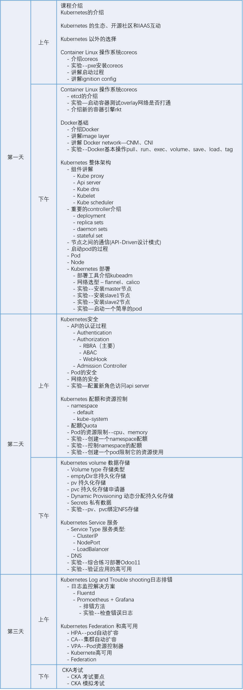

# 课程介绍

## Catalog
<!-- @import "[TOC]" {cmd="toc" depthFrom=1 depthTo=6 orderedList=false} -->

<!-- code_chunk_output -->

- [课程介绍](#课程介绍)
  - [Catalog](#catalog)
  - [CKA证书](#cka证书)
  - [课程约定](#课程约定)
  - [授课时间](#授课时间)
  - [课程环境](#课程环境)
  - [课程安排](#课程安排)

<!-- /code_chunk_output -->

本课程是针对CNCF推出的基于Kubernetes的管理员认证考试(CKA)，课程主要面向使用容器编排工作岗位的人群和想学习容器编排的学员，我们会围绕Kubernetes的部署和使用来展开课程，并介绍container Linux--coreos的基本使用、Docker容器的基本操作，课程结束后学员可以自行选择参加考试的时间，九州云负责协调。

## CKA证书


**CKA是Google CNCF云原生基金会和Linux 基金会官方2017年推出的Kubernetes管理员认证计划，也是目前官方唯一的云原生认证，用于证明持有人具备履行Kubernetes管理的知识、技能等相关的能力，认证是这一过程中的关键步骤，顺利通过认证的管理员和企业，证明在开源技术体系中有能力快速建立自己的信誉和价值。**

## 课程约定

+ 课程中需要学院输入的命令均以代码块的形式告知, 如:

***请手动在k8sMaster主机上输入以下命令***

```shell
df -Th
```

+ 课程中所有的yaml或者yml文件都已经准备好，所以不需要从头去写。

+ 课程中我们会将Kubernetes简称为k8s。
  
+ 所有用vnc viewer连接进去的学员，登录密码为trystack，在进入命令行后请用su root，密码为trystack，切换到root账号。

## 授课时间

授课时间共4天, 每天上课时间如下:

_|_
:-: | -
上午 | 9:30 ~ 11:30
下午| 1:30~ 4:30

## 课程环境

+ **宿主机**

_|_
:-: | -
主机名 | host
主机类型 | 物理机
状态 | 已有
系统 | centos 7.x
用户名/密码 | root/trystack
用途 | 宿主机用来做虚拟化

---

+ **pxe主机**

_|_
:-: | -
kvm主机名 | pxe_server
主机类型 | kvm虚拟机
状态 | 已有
系统 | centos 7.0
用户名/密码 | root/trystack
用途 | pxe服务器负责推coreos操作系统

---

+ **coreos虚拟机1**

_|_
:-: | -
kvm主机名 | core_master
主机类型 | kvm虚拟机
状态 | 待创建
系统 | coreos 1632.2.1
用户名/密码 | core/需要ssh密钥
用途 | 演示etcd和flannel的第一个节点

---

+ **coreos虚拟机2**

_|_
:-: | -
kvm主机名 | core_slave1
主机类型 | kvm虚拟机
状态 | 待创建
系统 | coreos 1632.2.1
用户名/密码 | core/需要ssh密钥
用途 | 演示etcd和flannel的第二个节点

---

+ **k8s Master主机**

_|_
:-: | -
kvm主机名 | k8s_master
主机类型 | kvm虚拟机
状态 | 已有
系统 | Ubuntu 16.04 Server
用户名/密码 | trystack/trystack
用途 | k8s的master节点

---

+ **k8s Work Node1主机**

_|_
:-: | -
kvm主机名 | k8sWorkNode1
主机类型 | kvm虚拟机
状态 | 已有
系统 | Ubuntu 16.04 Server
用户名/密码 | trystack/trystack
用途 | k8s的工作节点

---

+ **k8s Work Node2主机**

_|_
:-: | -
kvm主机名 | k8sWorkNode2
主机类型 | kvm虚拟机
状态 | 已有
系统 | Ubuntu 16.04 Server
用户名/密码 | trystack/trystack
用途 | k8s的工作节点

---

## 课程安排


