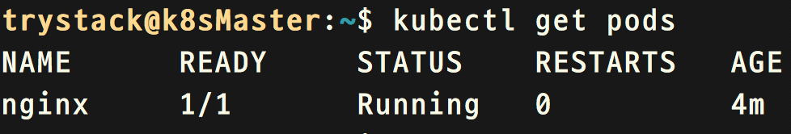

# kubernetes cluster 部署

在这一章教程中，我们将会安装k8s的master节点，并且添加一个工作节点( work node )。  

## 部署工具kubeadm介绍

像很多开源工具一样，部署大规模集群的时候，一个一个节点手动部署将会浪费很多的时间，还要面临认为的失误等问题，所以一个好的部署工具室必不可少的， `kubeadm` 是社区里一个非常热门的部署工具项目，也是很多多节点部署 k8s 场景下的第一选择，当然除了kubeadm意外还有非常适合all in one的部署工具 `minikube` 。 课程当中我们不会讲 minikube 的使用，对此工具感兴趣的同学可以自行学习。  

## 网络组件的选择flannel/calico

在安装之前我们首先要选型，如网络模块，社区中提供了集中解决方案，但是`flannel`无法做到Pod与Pod之间通信的安全隔离(Network Policies)，试想如果把k8s做成CAAS公有云(container as a service)，那么问题就来了，两个用户的Pod之间如果能够相互访问，就有了不安全的因素. 在本课程当中我们使用`Calico`作为网络组件，除了Calico以外还有需要多项目支持网络安全策略比如:Romana/Cilium/Kube-route/WeaveNet等。  

## 实验-安装master节点

> 我们要使用 `CentOS 7.x` 来安装k8s的master节点，并且它是一台虚拟机，我们使用 kvm(kernel-base virtual machine)作为虚拟机监控器(hypervisor)。  

- 登录课程环境(北京授课)

    北京授课的同学需要登录远程课程环境。  

    北京的同学，需要在主机电脑上安装 `vnc viewer`，单击[此处](https://www.realvnc.com/en/connect/download/viewer/windows/)下载并安装 vnc viewer。  

    完成安装后双击 vnc viewer 来打开它，并输入授课讲师分配给大家的IP地址然后按回车键，注意这里的端口 5901m，根据 vnc 连接数量会改变，一般都在 5901/5902/5903 之间变化，如果发现 5901 无法连接，请尝试其他端口号。  

    

    在弹出密码的位置输入 trystack

    

- 打开 vrit manager

    连接到实验环境后，我们需要打开virt manager，它是一个视图化管理kvm的工具。

    

    使用vnc viewer连接进入实验环境的同学会被要求输入一个密码，直接输入 trystack。

    

    

- 开启虚拟机

    如果这2台虚拟机是关闭着的情况下，你可以右击虚拟机并点击Open,然后点击开始按钮。

    

- 登录master节点

    右击桌面空白处，选择Terminal。

    

    ```shell
    # 登录master节点
    root@host ~ $  ssh trystack@10.0.0.100

    # 安装docker
    trystack@k8sMaster ~ $ sudo -s  
    root@k8sMaster ~ $ apt update -y && apt install -y docker.io

    # 开启ipvs功能
    root@k8sMaster ~ $ apt install -y ipvsadm
    root@k8sMaster ~ $ modprobe ip_vs && modprobe ip_vs_rr && modprobe ip_vs_wrr && modprobe ip_vs_sh
    ```

- 安装软件包和装载软件包

    ```shell
    # 安装需要的软件包
    # 因为这些软件包是从google上下载的，受限于国内的网络防火墙
    # 我们预先下载了这些软件包，方便大家安装
    # kubeadm需要的容器的镜像也是从gcr.io上下载的
    # 我们也预先为大家下载了下来
    # 关闭swap
    root@k8sMaster ~ $ ./pre_install_script
    ```

- Kubeadm init初始化master节点

    ```shell
    # 部署节点无非就是把一些容器镜像运行起来提供服务
    root@k8sMaster ~ $  kubeadm init --config kubeadm.conf
    # 你应该能看到以下输出内容
    ```

    

- 配置kubectl工具

    K8s命令行工具在使用前，需要通过 api-server 的 TLS 认证，所以在使用前我们需要把各种证书配置到当前用的.kube文件夹下。

    ```shell
    root@k8sMaster ~ $  exit
    trystack@k8sMaster ~ $ mkdir .kube
    # 拷贝admin.conf证书文件到新建的.kube文件里
    trystack@k8sMaster ~ $ sudo cp -i /etc/kubernetes/admin.conf /home/trystack/.kube/config  

    # 修改之前拷贝过来的文件config，把权限设置为当前用户
    trystack@k8sMaster ~ $ sudo chown $(id -u):$(id -g) /home/trystack/.kube/config
    ```

- 启动calico容器

    Kubectl工具已经准备好了，现在可以通过kubectl工具来启动pod了，现在master节点的网络组件还没有设置好，我们接下去就要启动calico。

    ```shell
    # 运行calico容器，注意calico.yaml文件里的CALICO_IPV4POOL_CIDR字段必须要和kubeadm.conf文件中的cidr相同的地址段。
    trystack@k8sMaster ~ $ kubectl create -f rbac-kdd.yaml
    trystack@k8sMaster ~ $ kubectl create -f calico.yaml
    ```

- 确认maskter节点

    ```shell
    trystack@k8sMaster ~ $  kubectl get nodes
    # 你应该看到下面的输出，注意应该是Ready的
    ```

    

## 实验-安装work/slave节点

刚才已经完成master节点的部署，接下来要扩大安装的集群，添加一个work/slave节点。

- 登录work节点

    ```shell
    # 登录work节点
    root@host ~ $  ssh trystack@10.0.0.110

    # 安装docker
    trystack@k8sSlave1 ~ $ sudo -s  
    root@k8sSlave1 ~ $ apt update -y && apt install -y docker.io
    root@k8sMaster ~ $ apt install -y ipvsadm
    root@k8sMaster ~ $ modprobe ip_vs && modprobe ip_vs_rr && modprobe ip_vs_wrr && modprobe ip_vs_sh
    ```

- 安装软件包

    安装的软件和加载的镜像完全和Master节点一样，所以这里就不重复了，请参考之前master节点安装软件包和镜像那一章。

    ```shell
    root@k8sSlave1 ~ $ ./pre_install_script
    ```

- 加入集群

    这时候已经将master和work/slave节点安装好了，接下来需要把work节点添加到master集群当中，加入集群是一个很重要的环节，我们需要防止恶意的节点加入，所以我们需要用master节点授权才能加入集群。

    ```shell
    # 获取master节点上的token
    root@k8sMaster ~ $  kubeadm token list
    ```

    

    ```shell
    # 利用kubeadm join命令加入集群
    # 注意--token后面的值是上面我们获取的
    # 注意toke后面有个空格后面跟着master节点的ip和端口号
    # 最后在前面加密证书后得到的值前面加上sha256:
    root@k8sSlave1 ~ $ kubeadm join --token 1a73b4.3699310116e50b4d 10.0.0.100:6443 --discovery-token-ca-cert-hash sha256:73db0f4798163b15c2ed6d5bd8fdd4323b28da508cae9081e29b3bacc384631a
    # 你会看到如下的输出，现在kubeadm会启动calico并沿用master上的设置,并且自动配置kubelet服务的systemd文件并启动。
    ```

    

- 检查节点状态

    ```shell
    # 检查节点状态
    root@k8sMaster ~ $ kubectl get nodes
    # 注意你可能会看见k8sslave1的状态是NotReady
    # 不用着急，因为kubeadm正在启动calico容器会要花一些时间的
    # 多运行几次，你应该看到以下内容
    ```

    

- 允许master作为一个work/slave节点

    k8s的master节点安装完成以后,默认k8s只允许master节点运行k8s自己组件pod，在我们的环境资源有限的情况下，我们需要master节点也加入到普通的work/slave节点。

    ```shell
    # 移除master节点的taint标签(我们会在后期介绍这些功能)
    trystack@k8sMaster ~ $ kubectl taint nodes --all node-role.kubernetes.io/master-
    ```

## 实验-启动一个简单的Pod

k8s集群已经搭建好了，接下来快速启动一个nginx的pod，感受一下pod的魅力吧。

```shell
# 用kubectl create命令 启动一个pod
trystack@k8sMaster ~ $ kubectl create -f /home/trystack/course_lab/lab13-5/first_pod.yaml
# 让我们看下这个yaml文件
# 通过kubectl get pod命令我们可以看到这个pod已经运行正常了
```



## 实验-添加kubectl命令行提示

使用了kubectl命令行工具，没有tab补全提示是不是很不方便？那接下来就添加命令行提示的功能

```shell
trystack@k8sMaster ~ $ source <(kubectl completion bash)
trystack@k8sMaster ~ $ echo "source <(kubectl completion bash)" >> ~/.bashrc
# 同学们试下kubectl des[tab] po[tab] ngi[tab]的效果
```

## 实验—启动一个静态Pod

要知道一些k8s本身依赖的服务组件api-server等等他们部署的时候可以部署成为一个Pod，那么k8s在能提供服务之前，这些Pod肯定要已经运行了，所以就会有先后的问题，k8s是通过kubelet这个systemd服务来确保这些Pod在整个k8s能够工作之前就已经运行正常了，我们称kubelet直接管理的这种Pod叫做静态Pod，默认kubelet会通过读取/etc/kubernetes/manifests目录下的Pod的定义文件来启动他们，我们这个联系的目的是通过添加一个Pod定义文件来启动一个静态的Pod。

```shell
# 切换到root，因为trystack没有权限写目录/etc/kubernets/manifests
trystack@k8sMaster ~ $  sudo -s

# 将静态文件拷贝到/etc/kubernetes/manifests/目录下
root@k8sMaster ~ $  cp course_lab/lab13-7/static_pod.yaml \ 
root@k8sMaster ~ $  /etc/kubernetes/manifests/
root@k8sMaster ~ $  exit

# 我们会看到一个static pod已经启动了
trystack@k8sMaster ~ $  kubectl get pods
```


```shell
# 试着删除pod，发现不管怎么删除这个pod都会自己启动
trystack@k8sMaster ~ $  kubectl delete pods static-pod-k8smaster110
trystack@k8sMaster ~ $  kubectl get pods
```
