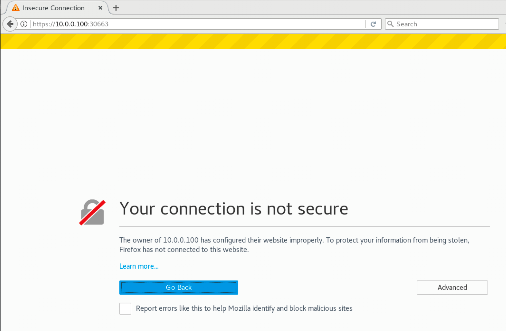

# Kubernetes面板部署

之前在操作 k8s 的时候都是通过命令行工具，但是不是所有人都喜欢使用命令行工具来工作，所以有一个视图化的管理工具是非常有必要的，但是 k8s 的 dashboard 目前功能不是很强大。

## Catalog

<!-- @import "[TOC]" {cmd="toc" depthFrom=1 depthTo=6 orderedList=false} -->

<!-- code_chunk_output -->

- [Kubernetes面板部署](#kubernetes%e9%9d%a2%e6%9d%bf%e9%83%a8%e7%bd%b2)
  - [Catalog](#catalog)
  - [实验--部署dashboard](#%e5%ae%9e%e9%aa%8c--%e9%83%a8%e7%bd%b2dashboard)

<!-- /code_chunk_output -->

## 实验--部署dashboard

> 实验目的：通过 yaml 文件部署 Dashboard，然后用之前创建的 service account 来登录 dashboard

```shell
#dashboard无非就是一个或多个 Pod，直接通过 yaml 启动 dashboard 的 pod
trystack@k8sMaster ~ $  kubectl create -f /home/trystack/course_lab/lab15-1/kubernetes-dashboard.yaml
#dashboard 启动后，会自动启动一个服务(后面章节具体解释)
#要想访问 dashboard 我们需要知道它的服务发布在哪个随机的端口下
trystack@k8sMaster ~ $  kubectl get svc --all-namespaces
```


```shell
#打开浏览器访问https://10.0.0.100:30663/
#点击 "advanced" 选项并点击 "add Exceptin"
#然后点击 "confirm"
#复制下面输出的 token，参阅练习14.6
trystack@k8sMaster ~ $  kubectl describe secret -n kube-system sa-cluster-admin-token-2t4vc
#最后黏贴到页面上的 token 栏里面，最后点击 SIGN IN
```




