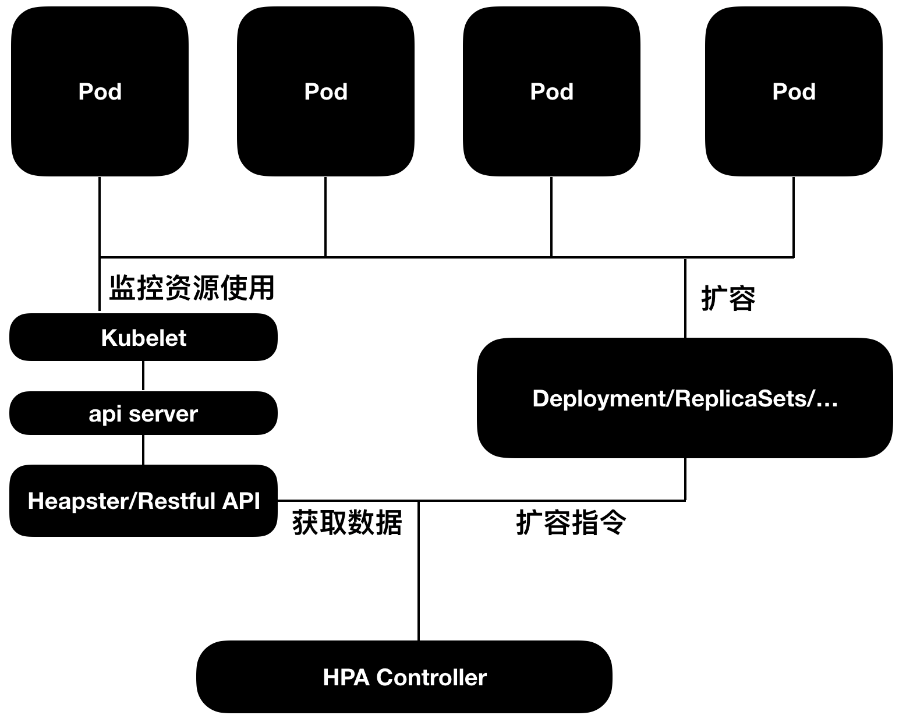
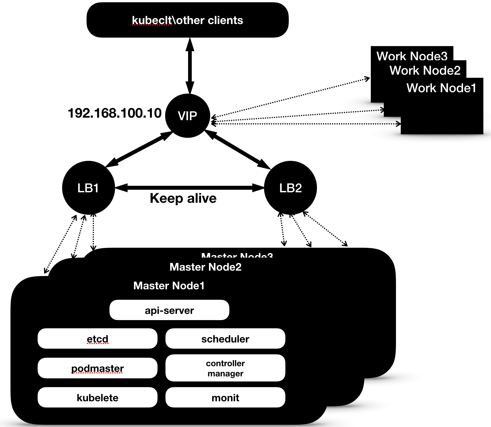
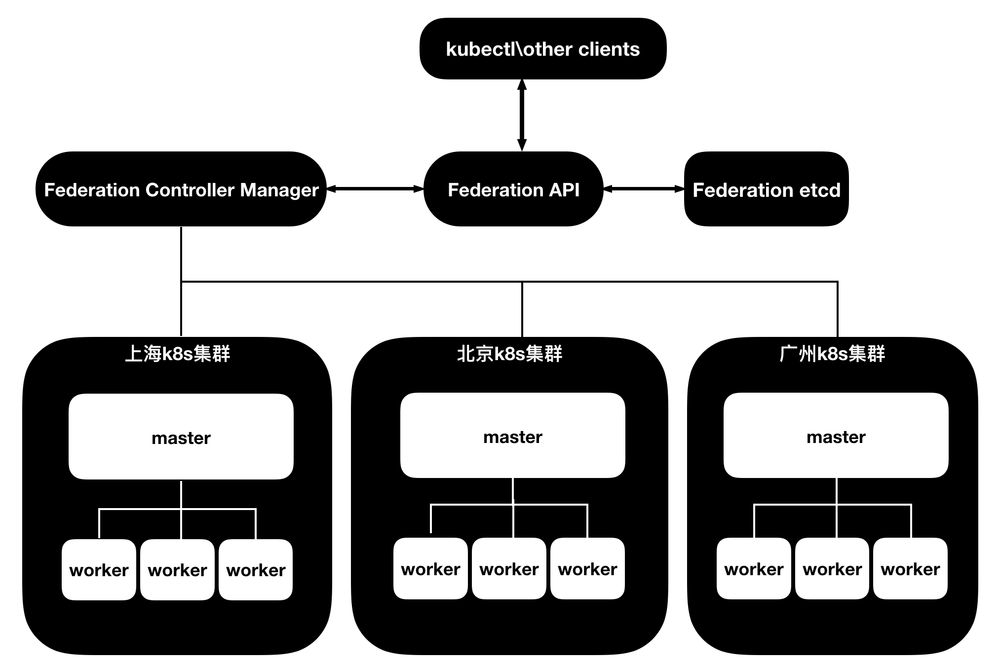

# Kubernetes 联邦和高可用

在这一章节内我们会讨论 k8s 的高可用方案和一些自动扩容的特性，还有基于多集群的 Federation。

## Catalog

<!-- @import "[TOC]" {cmd="toc" depthFrom=1 depthTo=6 orderedList=false} -->

<!-- code_chunk_output -->

- [Kubernetes 联邦和高可用](#kubernetes-%e8%81%94%e9%82%a6%e5%92%8c%e9%ab%98%e5%8f%af%e7%94%a8)
  - [Catalog](#catalog)
  - [HPA -- Pod 自动平行扩容](#hpa----pod-%e8%87%aa%e5%8a%a8%e5%b9%b3%e8%a1%8c%e6%89%a9%e5%ae%b9)
  - [CA -- 集群自动扩容](#ca----%e9%9b%86%e7%be%a4%e8%87%aa%e5%8a%a8%e6%89%a9%e5%ae%b9)
  - [VPA -- Pod 纵向扩容（测试功能）](#vpa----pod-%e7%ba%b5%e5%90%91%e6%89%a9%e5%ae%b9%e6%b5%8b%e8%af%95%e5%8a%9f%e8%83%bd)
  - [k8s 高可用](#k8s-%e9%ab%98%e5%8f%af%e7%94%a8)
  - [Federation](#federation)

<!-- /code_chunk_output -->

## HPA -- Pod 自动平行扩容

首先我们来讨论一下 Pod 的平行扩容 HPA -- Horizontal Pod Autoscalars, 它实现的形式是由一个控制器 (controller) 的形式出现，HPA 功能依赖于每个 Pod 资源使用的数据，最主要的就是 Pod 的 CPU 使用情况，HPA 获取资源使用量数据有 2 种途径：Heapster、RestfulApi:

- Heapster -- HPA 直接访问 Heapster 的 API 来获取数据。
- RestfulApi -- 你可以自己写程序从 api-server 中获取数据并提供给 HPA 控制器。

HPA 只要监测到 50%以上 CPU 使用量（间隔 30 秒），就会触发自动扩容，要开启自动扩容的功能首先你需要在 kube-controller-manager 启动命令中加入--horizontal-pod-autoscaler-use-rest-clients = true 和 --master=kube-apiserver 的 ip，或者--kubeconfig [配置文件地址]，这样 kube-controller-manager 才能和 api-server 通信，`但需要注意的是，你的 Pod 必须是通过 Deploment 或者 ReplicaSet 部署的，若是 Daemond Set 部署的 Pod 就不支持自动扩容。`

## CA -- 集群自动扩容

cluster autoscaler 集群自动扩容，目前只能运作在云平台上，支持的云平台有：GCE、GKE、AWS 和 Azure。它是一个单独运行的程序，运行在 k8s 的 master 节点上，它根据每个节点的运行状况来做出判断，然后进行 scale out 或者 scale down，比如 CA 发现你的一个节点上很久没有启动新的 Pod 了，然后正在这个节点上的 Pod 可以运行在其他节点上，这时 CA 就会自动 Scale Down，关闭并删除这个节点，当然在关闭 Pod 前有个一个缓冲期，最长为 10 分钟。又比如你的一个节点 CPU 的使用量几乎满了，然后新建的 Pod 因为资源不够变为 Pending 状态时，CA 就会新建一个节点。详细信息你可以通过访问以下链接来了解更多：[https://github.com/kubernetes/autoscaler/tree/master/cluster-autoscaler](https://github.com/kubernetes/autoscaler/tree/master/cluster-autoscaler)。

你还可以访问 google 写的关于 CA 的一些详细算法和使用的注意事项的文章：[https://cloud.google.com/kubernetes-engine/docs/concepts/cluster-autoscaler](https://cloud.google.com/kubernetes-engine/docs/concepts/cluster-autoscaler)

## VPA -- Pod 纵向扩容（测试功能）

VPA -- Vertical Pod Autoscaler 纵向扩容，指的是实时调整 Pod 的 CPU 和内存的使用量，可以纵向扩容和收缩，用户通过一个 CR (Custom Resource /用户自定义的 API 对象）来选择哪些 Pod 需要接收 VPA 的规则。目前还是测试功能所以有很多限制，具体详情同学们可以查询以下链接来了解：[https://github.com/kubernetes/autoscaler/tree/master/vertical-pod-autoscaler](https://github.com/kubernetes/autoscaler/tree/master/vertical-pod-autoscaler)

## k8s 高可用

每个健壮的集群都需要满足它的高可用场景，k8s 也不例外，k8s 的高可用我们主要关注 2 个要点：etcd 数据库的高可用、依赖服务的高可用，还有他们的投票机制。Master 节点应该为奇数，避免脑裂，你可以访问以下链接来了解更多：[https://kubernetes.io/docs/admin/high-availability/building/](https://kubernetes.io/docs/admin/high-availability/building/) 以下是部署高可用 k8s 集群的一些要点：

- 依赖服务的高可用

    依赖服务就是k8s的那些核心服务：api-server、controller manager等，这些服务是由kubelet监控并负责重启的，我们需要保证kubelet服务是可用的，就需要一个软件来监控和管理kubelet的高可用，你可以使用monit，当然你也有很多其他的选择。

- 集群信息存储

    k8s将集群的数据信息都存放在了etcd数据库当中，我们可以很容易的为etcd创建数据库的高可用，etcd会把数据存放在所有etcd集群中的磁盘上，除非磁盘同时损坏，否则数据完全丢失的可能性比较小，为了万无一失，你还可以对节点的物理存储设备做一些高可用的文章。

- Endpoint调节器

    在启动api-server的时候你需要加入 --apiserver-count=3，通常这个数字和你master节点的集群数量相等。

- Load Balance 本身的高可用

    同时我们要考虑负载均衡器的高可用，我们可以使用类似keep alive这样的组件来保证负载均衡器本身是高可用的，当然如果不考虑成本，你有像F5这样的物理负载均衡设备那是非常理想的。

- 投票机制

    在启动api-server的时候你需要加入 --apiserver-count=3，通常这个数字和你的master节点的集群数量相等。

## Federation

我们之前讨论的功能都是在一个k8s集群当中，但如果我们有多个数据中心，并且我希望我的资源可以在多个k8s集群当中做调度，或者说多数据中心的这种场景，这时我们就需要Federation，它能帮助我们把应用在多个k8s集群当中进行调度和操作，你可以访问这里来来接更多Federation信息：[https://kubernetes.io/docs/concepts/cluster-administration/federation/#caveats](https://kubernetes.io/docs/concepts/cluster-administration/federation/#caveats)

