# kubernetes介绍

## Catalog
<!-- @import "[TOC]" {cmd="toc" depthFrom=1 depthTo=6 orderedList=false} -->

<!-- code_chunk_output -->

- [kubernetes介绍](#kubernetes%e4%bb%8b%e7%bb%8d)
  - [Catalog](#catalog)
  - [Kubernetes的介绍 (Catalog)](#kubernetes%e7%9a%84%e4%bb%8b%e7%bb%8d-catalog)
  - [Kubernetes的生态、开源社区](#kubernetes%e7%9a%84%e7%94%9f%e6%80%81%e5%bc%80%e6%ba%90%e7%a4%be%e5%8c%ba)
    - [生态](#%e7%94%9f%e6%80%81)
    - [社区](#%e7%a4%be%e5%8c%ba)
    - [周边资源](#%e5%91%a8%e8%be%b9%e8%b5%84%e6%ba%90)
  - [Kubernetes之外的选择 (Catalog)](#kubernetes%e4%b9%8b%e5%a4%96%e7%9a%84%e9%80%89%e6%8b%a9-catalog)
    - [Docker swam](#docker-swam)
    - [Apache Mesos](#apache-mesos)
    - [Nomad from HashiCorp](#nomad-from-hashicorp)
    - [Rancher](#rancher)
  - [一个简单的例子 (Catalog)](#%e4%b8%80%e4%b8%aa%e7%ae%80%e5%8d%95%e7%9a%84%e4%be%8b%e5%ad%90-catalog)
    - [描述](#%e6%8f%8f%e8%bf%b0)
    - [环境准备](#%e7%8e%af%e5%a2%83%e5%87%86%e5%a4%87)
    - [启动MySql服务](#%e5%90%af%e5%8a%a8mysql%e6%9c%8d%e5%8a%a1)
    - [构建Mysql Kubernetes Service定义文件](#%e6%9e%84%e5%bb%bamysql-kubernetes-service%e5%ae%9a%e4%b9%89%e6%96%87%e4%bb%b6)
    - [启动Tomcat应用](#%e5%90%af%e5%8a%a8tomcat%e5%ba%94%e7%94%a8)
    - [构建Tomcat Kubernetes Service定义文件](#%e6%9e%84%e5%bb%batomcat-kubernetes-service%e5%ae%9a%e4%b9%89%e6%96%87%e4%bb%b6)
  - [k8s架构 (Catalog)](#k8s%e6%9e%b6%e6%9e%84-catalog)
    - [重要概念](#%e9%87%8d%e8%a6%81%e6%a6%82%e5%bf%b5)
    - [kube-apiserver](#kube-apiserver)
    - [etcd](#etcd)
    - [kube-scheduler](#kube-scheduler)
    - [kube-controller-manager](#kube-controller-manager)
    - [kubelet](#kubelet)
    - [kube-proxy](#kube-proxy)
    - [kube-dns](#kube-dns)
    - [dashboard(web-ui)](#dashboardweb-ui)
    - [Replication Controller](#replication-controller)
    - [API Driven的软件设计](#api-driven%e7%9a%84%e8%bd%af%e4%bb%b6%e8%ae%be%e8%ae%a1)
    - [运行一个应用部署器(Deployment)的过程](#%e8%bf%90%e8%a1%8c%e4%b8%80%e4%b8%aa%e5%ba%94%e7%94%a8%e9%83%a8%e7%bd%b2%e5%99%a8deployment%e7%9a%84%e8%bf%87%e7%a8%8b)

<!-- /code_chunk_output -->

## Kubernetes的介绍 ([Catalog](#catalog))

最早在google内部运行了很长时间, 最终google将borg贡献到开源社区由cncf(Cloud Native Computing Foundation)来托管, 并改名为Kubernetes, Kubernetes在希腊语中是领航员(κνβερνητης)的意思,您可以从[cncf的官方网站](https://www.cncf.io/)的毕业项目(graduated project)下找到Kubernetes. 

Kubernetes 主要对于容器进行编排(orchestration), 随着Kubernetes的发展, 还可以编排容器以外的轻量级的qemu虚拟机(Hyper Container), 类似于OpenStack中的Kata Container. 

使用Kubernetes可以避免我们直接对container进行操作, 概念就像IAAS平台中, 屏蔽了我们直接对底层的虚拟机进行操作一样, 只是IAAS平台编排的是虚拟机, Kubernetes编排的是container或者轻量级的qemu虚拟机, 它提供了统一的持久化和非持久化的存储接口, 并可以集成各种文件系统来为Pod提供存储, 还提供了安全管理机制和资源管理机制等. 

在国内我们称Kubernetes叫做k8s, 但在国外叫做kate`s. 

请在开始课程前记住一句话: It`s all about orchestration/都是编排. 

## Kubernetes的生态、开源社区

> 在这个章节里, 我们将介绍k8s的生态, 比如谁在用k8s, 用的怎么样, 还有我们将介绍一下开源社区和一些周边的资源和组织, 最后我们将介绍一下k8s和IAAS集成的项目.

### 生态

首先看下哪些大公司正在使用k8s, 这些企业多多少少做了一些定制, 所以我们除了可以说是一种解决方案也可以说是k8s的一个分支(DISTRIBUTIONS), 概念有点像Linux操作系统.  

- Alibaba Cloud Container Service  
    阿里巴巴的Alibaba Cloud Container Service, 提供了用户在阿里云上运行容器的功能, 很好的支持k8s作为容器的编排工具.  
- Amazon Elastic Container Service for k8s (ESK)  
    AWS的容器服务ESK, 用户可以在aws云服务上快速运行k8s并且不需要安装任何组件, 你的容器会被AWS的k8s集群来编排, 当前ESK还是预览版(Preview), 当然也可以选择成熟ECS(Amazon Elastic Container Service)
- Azure Container Service/ AKS  
    微软的CAAS服务, 在微软的Azure Platform上部署容器并编排.  
- Google Kubernetes Engine  
    在Google Cloud Platform上运行容器, 您可以通过管理经google强化过的k8s来编排你的容器. 
- Openshift Origin  
    红帽社区版的k8s项目, 底层封装了k8s, 提升了用户使用体验等等.  
- Red Hat OpenShift Online  
    红帽的公有云容器服务, 你可以通过管理经红帽强化过的OpenShift来编排你的容器.  
- Red Hat OpenShift Dedicated  
    在公有云上部署OpenShift大规模集群, 比如在AWS和GCP上.  
- Tectonic (CoreOS)  
    企业级的k8s产品, 利用coreos操作系统在企业内部署基于容器编排的私有云的产品, 它使用的是100% k8s社区源码.  

### 社区

- 团体 -- 所有开源项目的活跃程度很大部分取决于它在社区的活跃度, 首先k8s社区每个月都会有很多会议和活动, 您可以查看社区的[会议日程](https://kubernetes.io/community/),社区里还有很多兴趣小组Special Interest Groups(SIGS), 除了兴趣小组以外, 还有工作组Working Groups, 您可以从这里看到[组员和他们来自于什么公司](https://github.com/kubernetes/community/blob/master/sig-list.md)
- 源码 -- 如果同学想要接触k8s源码, 你可以从GitHub上获取, 当然如果你想要能运行的话, 需要有[go语言的环境](https://github.com/kubernetes)
- 开发--开发分为多种:
  - API调用开发 -- k8s是基于API的开发模式, 所有请求通过授权以后都可以访问k8s资源, 所以你想要做外接程序去读取k8s的数据, 需要先学习API调用开发. 
  - k8s组件开发 -- 通过完善或者新增k8s的组件, 如api server等来为k8s做贡献, 开始前你需要会go语言. 
  - 微服务开发 -- 在底层运行的容器中开发你自己的应用. 
  - 幸运的是, 不管以上哪种开发, 你都可以从GitHub上学习到[如何开始](https://github.com/kubernetes/community/tree/master/contributors/devel)

### 周边资源

- [K8s官方网站](https://kubernetes.io/) -- [https://kubernetes.io/](https://kubernetes.io/)
- [Devstate](https://k8s.devstats.cncf.io/d/12/dashboards?refresh=15m&orgId=1) -- 统计k8s项目在GitHub上的活跃度
- [KubeCon](https://events.linuxfoundation.cn/events/kubecon-cloudnativecon-china-2018/) -- cncf下的一个组织, 专门组织专业机构参加cncf会议, 开会讨论新方向等. 
- [Stack overflow](https://stackoverflow.com) -- 一个提关于k8s问题的网站. 
- [The New Stack](https://thenewstack.io) -- 专门做云计算新闻的网站, 大家可以在这里看到各种云项目的动态和电子书. 
- [Slack](https://slack.com) – 一个非常有意思的在线问题的平台. 

## Kubernetes之外的选择 ([Catalog](#catalog))

### Docker swam

Docker swam是Docker默认自带的容器编排工具. [Docker swam文档链接](https://docs.Docker.com/engine/swarm/)

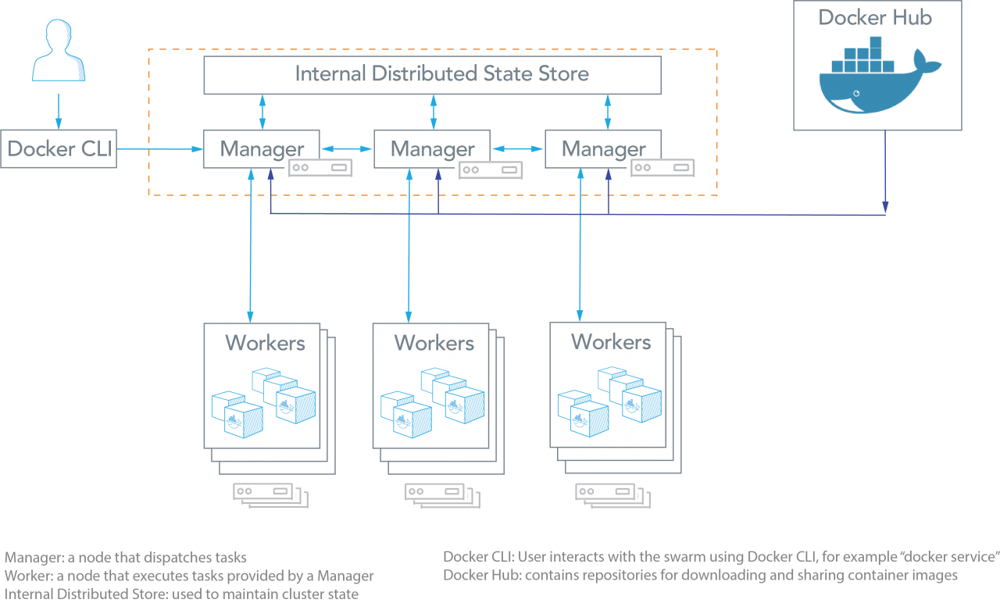

### Apache Mesos

Mesos是加利福尼亚大学的研究, 主要关注容器的编排, 利用cGroup来做资源管理, 它和大数据集成的非常紧密. [项目链接](http://mesos.apache.org/)

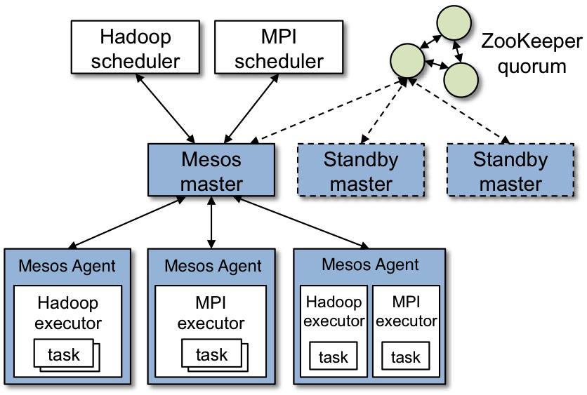

### Nomad from HashiCorp

Nomad是利用容器来发布我们的应用, 它在架构上支持多数据中心、多Region的编排, 支持自动扩容等. [项目链接](https://www.nomadproject.io/)

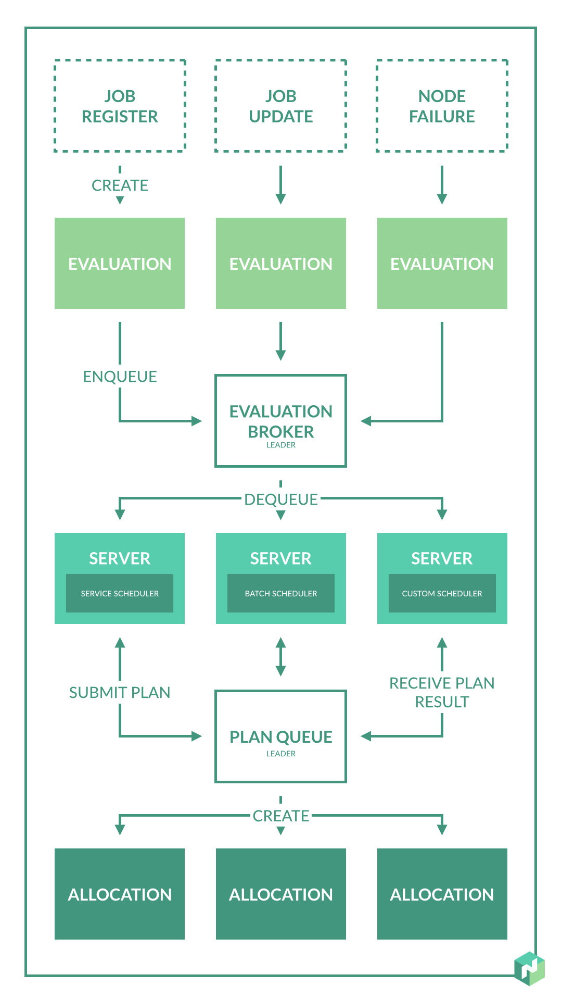

### Rancher

Rancher是一个用户体验很好的集群管理工具, 它封装了k8s作为它的底层, 并强化了用户体验, 降低了使用部署k8s的门槛,当然除了k8s它还支持Mesos、Docker Swam. [项目链接](https://rancher.com/)

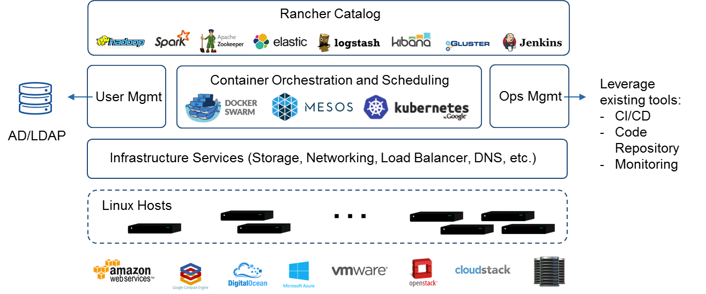

## 一个简单的例子 ([Catalog](#catalog))

### 描述

创建一个简单的Java web程序, 此Java Web应用的结构比较简单, 是一个运行在Tomcat里的Web App, 如下图所示, JSP页面通过JDBC直接访问MySQL数据库并展示数据. 为了演示和简化的目的, 只要程序正确连接到了数据库上, 它就会自动完成对应的Table的创建与初始化数据的准备工作. 所以, 当我们通过浏览器访问此应用的时候, 就会显示一个表格的页面, 数据则来自数据库. 

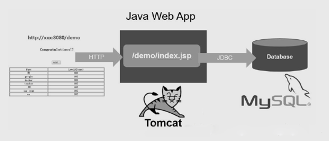

此应用需要启动两个容器：Web App容器和MySQL容器, 并且Web App容器需要访问MySQL容器.  在Docker时代, 假设我们在一个宿主机上启动了这两个容器, 则我们需要把MySQL容器的IP地址通过环境变量的方式注入Web App容器里；同时, 需要将WebApp容器的8080端口映射到宿主机的8080端口, 以便能在外部访问. 在本章的这个例子里, 我们看看在Kubernetes时代是如何完成这个目标的. 

### 环境准备

1. 虚拟机中安装CentOS 7.x, 确保网络畅通

2. 关闭CentOS自带的防火墙、关闭selinux

```shell
## 禁止firewalld开机启动
systemctl disable firewalld
## 关闭当前运行的firewalld
systemctl stop firewalld
## 临时关闭当前正在运行的selinux
setenforce 0
## 永久禁止selinux, 重启后生效
sed -i "s/SELINUX=enforcing/SELINUX=disabled/g" /etc/sysconfig/selinux
```

3. 安装 etcd和Kubernetes软件（会自动安装Docker软件）

```shell
yum install etcd kubernetes -y
```

4. 安装好软件后, 修改两个配置文件

```shell
Docker配置文件 /etc/sysconfig/docker, 其中OPTIONS的内容设置为：
OPTIONS='--selinux-enabled=false --insecure-registry gcr.io'
```

Kubernets apiserver配置文件 /etc/kubernetes/apiserver, 将 –adminssion_control参数中的ServiceAccount删除

5. 按顺序启动所有服务

```shell
systemctl start etcd
systemctl start docker
systemctl start kube-apiserver
systemctl start kube-controller-manager
systemctl start kube-scheduler
systemctl start kubelet
systemctl start kube-proxy
```

6. Docker拉取mysql镜像和tomcat镜像和mysql镜像

```shell
## 注意 这里拉取的是mysql:5.6, 不可以是最新的版本, 否则由于驱动的问题, 会导致jdbc 数据库连接错误. 
docker pull mysql:5.6

## tomcat镜像
docker pull kubeguide/tomcat-app:v1
```

### 启动MySql服务

1、首先为MySql服务创建一个RC定义文件`mysql-rc.yaml`, 内容如下

```yaml
apiVersion: v1
kind: ReplicationController
metadata:
  name: mysql
spec:
  replicas: 1
  selector:
    app: mysql
  template:
    metadata:
      labels:
        app: mysql
    spec:
      containers:
      - name: mysql
        image: mysql:5.6
        ports:
        - containerPort: 3306
        env:
        - name: MYSQL_ROOT_PASSWORD
          value: "123456"
```

2、发布到Kubernetes集群

2.1 创建RC

```shell
kubectl create -f mysql-rc.yaml
```

2.2 验证创建是否成功

```shell
# kubectl get rc
NAME      DESIRED   CURRENT   READY     AGE
mysql     1         1         0         3m

# kubectl get pods
NAME          READY     STATUS              RESTARTS   AGE
mysql-fbz1t   0/1       ContainerCreating 

```

*没创建成功* 会一直处于ContainerCreating

`主要是通过“kubectl describe pod PodName”指令查看pod发生的事件, 从事件列表中可以查找到错误信息. `

查看刚刚创建mysql相关pod的详细信息

```shell
# kubectl describe pod mysql
Name:		mysql-fbz1t
Namespace:	default
Node:		127.0.0.1/127.0.0.1
Start Time:	Tue, 24 Sep 2019 13:14:00 +0800
Labels:		app=mysql
Status:		Pending
IP:		
Controllers:	ReplicationController/mysql
Containers:
  mysql:
    Container ID:	
    Image:		mysql:5.6
    Image ID:		
    Port:		3306/TCP
    State:		Waiting
      Reason:		ContainerCreating
    Ready:		False
    Restart Count:	0
    Volume Mounts:	<none>
    Environment Variables:
      MYSQL_ROOT_PASSWORD:	123456
Conditions:
  Type		Status
  Initialized 	True 
  Ready 	False 
  PodScheduled 	True 
No volumes.
QoS Class:	BestEffort
Tolerations:	<none>
Events:
  FirstSeen	LastSeen	Count	From			SubObjectPath	Type		Reason	     Message
  ---------	--------	-----	----			-------------	--------	------	     -------
  38m		38m		1	{default-scheduler }			Normal		Scheduled    Successfully assigned mysql-fbz1t to 127.0.0.1
  38m		2m		12	{kubelet 127.0.0.1}			Warning		FailedSync   Error syncing pod, skipping: failed to "StartContainer" for "POD" with ErrImagePull: "image pull failed for registry.access.redhat.com/rhel7/pod-infrastructure:latest, this may be because there are no credentials on this request.  details: (open /etc/docker/certs.d/registry.access.redhat.com/redhat-ca.crt: no such file or directory)"

  37m	11s	163	{kubelet 127.0.0.1}		Warning	FailedSync	Error syncing pod, skipping: failed to "StartContainer" for "POD" with ImagePullBackOff: "Back-off pulling image \"registry.access.redhat.com/rhel7/pod-infrastructure:latest\""
```

> 通过最后一行错误提示, 下载镜像超时, 镜像地址默认是国外的服务器, 因为不可描述的原因无法访问, 所以需要使用国内镜像下载pod-infrastructure

这里选择阿里镜像服务, 当然也可以选择其他镜像服务

```shell
docker pull registry.cn-hangzhou.aliyuncs.com/sunyuki/pod-infrastructure
docker tag f66f4bd9b894 registry.access.redhat.com/rhel7/pod-infrastructure:latest
```

删除之前创建的rc, 重新创建MySql Rc

```shell
kubectl delete -f mysql-rc.yaml
kubectl create -f mysql-rc.yaml
```

再次使用`使用 # kubectl describe pod mysql `查看是否创建成功

```shell
# kubectl describe pod mysql-0rk7z 
Name:		mysql-0rk7z
Namespace:	default
Node:		127.0.0.1/127.0.0.1
Start Time:	Tue, 24 Sep 2019 14:19:24 +0800
Labels:		app=mysql
Status:		Running
IP:		172.17.0.3
Controllers:	ReplicationController/mysql
Containers:
  mysql:
    Container ID:	docker://be0b79eeca25e855b25c18b697502840a67d0b97e3782d49f2047ae721324076
    Image:		mysql:5.6
    Image ID:		docker-pullable://docker.io/mysql@sha256:07ebe49dc810444e172c2b5a72ae1a23ad9f4942bfe70a7f0a578590da610579
    Port:		3306/TCP
    State:		Running
      Started:		Tue, 24 Sep 2019 14:19:24 +0800
    Ready:		True
    Restart Count:	0
    Volume Mounts:	<none>
    Environment Variables:
      MYSQL_ROOT_PASSWORD:	123456
Conditions:
  Type		Status
  Initialized 	True 
  Ready 	True 
  PodScheduled 	True 
No volumes.
QoS Class:	BestEffort
Tolerations:	<none>
Events:
  FirstSeen	LastSeen	Count	From			SubObjectPath		Type		ReasoMessage
  ---------	--------	-----	----			-------------		--------	------------
  42s		42s		1	{default-scheduler }				Normal		Scheduled		Successfully assigned mysql-0rk7z to 127.0.0.1
  42s		42s		2	{kubelet 127.0.0.1}				Warning		MissingClusterDNS	kubelet does not have ClusterDNS IP configured and cannot create Pod using "ClusterFirst" policy. Falling back to DNSDefault policy.
  42s		42s		1	{kubelet 127.0.0.1}	spec.containers{mysql}	Normal		PulleContainer image "mysql:5.6" already present on machine
  42s		42s		1	{kubelet 127.0.0.1}	spec.containers{mysql}	Normal		Created			Created container with docker id be0b79eeca25; Security:[seccomp=unconfined]
  42s		42s		1	{kubelet 127.0.0.1}	spec.containers{mysql}	Normal		Started			Started container with docker id be0b79eeca25
```

没有报错, 创建成功

通过`docker ps` 查看正在运行的容器

```shell
# docker ps | grep mysql
be0b79eeca25        mysql:5.6                                                    "docker-entrypoint..."   2 minutes ago       Up 2 minutes                            k8s_mysql.65db1e76_mysql-0rk7z_default_4106ff62-de93-11e9-a421-000c29d7c9f9_5a52ff09
9a43189cd01e        registry.access.redhat.com/rhel7/pod-infrastructure:latest   "/pod"                   2 minutes ago       Up 2 minutes                            k8s_POD.1d520ba5_mysql-0rk7z_default_4106ff62-de93-11e9-a421-000c29d7c9f9_20eb184b
```

### 构建Mysql Kubernetes Service定义文件

创建文件`mysql-scv.yaml`, 内容如下

```yaml
apiVersion: v1
kind: Service
metadata:
  name: mysql
spec:
  ports:
    - port: 3306
  selector:
    app: mysql
```

1. 创建Service

```shell
# kubectl create -f mysql-scv.yaml
service "mysql" created
```

2. 查看创建的service

```shell
# kubectl get svc
NAME         CLUSTER-IP       EXTERNAL-IP   PORT(S)    AGE
kubernetes   10.254.0.1       <none>        443/TCP    1h
mysql        10.254.218.119   <none>        3306/TCP   45s
```

> 注意到MySql服务被分配了一个值为10.254.138.253的ClusterIP地址, 这是一个虚地址, 随后Kubernetes集群中其他新创建的Pod就可以通过Service的ClusterIP+端口号6379来连接和访问它. 根据Service的唯一名字, 容器可以从环境变量中获取到Service对应的ClusterIP地址和端口, 从而发起TCP/IP连接请求了.  

### 启动Tomcat应用

> 上面我们定义和启动了MySql服务, 接下来我们采用同样的步骤, 完成Tomcat应用的启动过程.  

1. 创建对应的RC文件`myweb-rc.yaml`, 内容如下

```yaml
apiVersion: v1
kind: ReplicationController
metadata:
  name: myweb
spec:
# Pod的数量
  replicas: 1
# spec.selector与spec.template.metadata.labels, 这两个字段必须相同, 否则下一步创建RC会失败. 
  selector:
    app: myweb
  template:
    metadata:
      labels:
        app: myweb
#   容器组的定义
    spec:
      containers:
#       容器名称
        - name: myweb
#         容器对应的镜像
          image: kubeguide/tomcat-app:v1
          ports:
#         在8080端口上启动容器进程, PodIP与容器端口组成Endpoint, 代表着一个服务进程对外通信的地址
          - containerPort: 8080
          env:
          - name: MYSQL_SERVICE_HOST
            value: 'mysql'
          - name: MYSQL_SERVICE_PORT
            value: '3306'
```

2. 发布到Kubernetes集群

2.1 创建RC

```shell
# kubectl create -f myweb-rc.yaml 
replicationcontroller "myweb" created
```

2.2 验证创建是否成功

```shell
[root@localhost yaml]# kubectl get rc
NAME      DESIRED   CURRENT   READY     AGE
mysql     1         1         1         15m
myweb     1         1         1         31s
[root@localhost yaml]# kubectl get pods
NAME          READY     STATUS    RESTARTS   AGE
mysql-0rk7z   1/1       Running   0          15m
myweb-dwrsq   1/1       Running   0          36s
```

### 构建Tomcat Kubernetes Service定义文件

文件名为`myweb-svc.yaml`, 内容如下：

```yaml
apiVersion: v1
kind: Service
metadata: 
  name: myweb
spec:
  type: NodePort
  ports:
    - port: 8080
      nodePort: 30001
  selector:
    app: myweb
```

1. 创建Service

```shell
# kubectl create -f myweb-svc.yaml 
service "myweb" created
```

2. 查看创建的Service

```shell
# kubectl get svc 
NAME         CLUSTER-IP       EXTERNAL-IP   PORT(S)          AGE
kubernetes   10.254.0.1       <none>        443/TCP          1h
mysql        10.254.218.119   <none>        3306/TCP         11m
myweb        10.254.206.12    <nodes>       8080:30001/TCP   48s
```

> myweb可以通过30001这个端口访问myweb（对应到8080的虚端口上）

浏览器中见到如下页面即创建成功

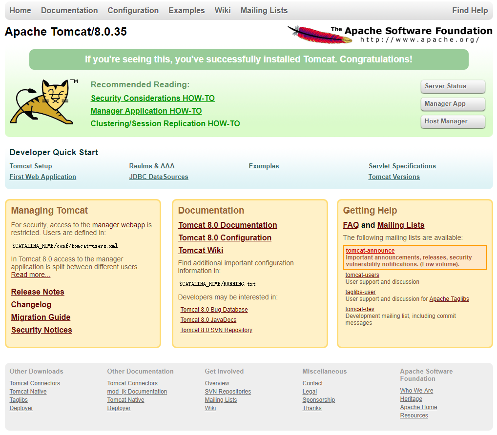

## k8s架构 ([Catalog](#catalog))

> 在开始k8s试验之前, 为了让大家更好的理解k8s的构成, 有很多重要的概念需要了解.  

### 重要概念

Pod -- 是k8s中最小的单元, 除非我们需要排错的时候, 一个Pod是一个或多个容器组成的, 在一个Pod中的容器通常用共享存储或者localhost来互相访问的, 启动这些容器的的镜像通常是一个定制过的微服务(一个容器一个服务). 一个标准的微服务Pod通常有2个容器组合而成, 一个负责提供服务另一个负责收集日志, 这样的模式叫做side car

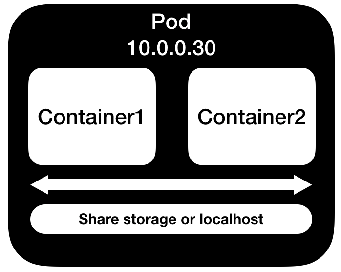

Node -- 节点是运行Pod的载体, 可以是一个物理服务器, 也可以是一个云平台上的虚拟机或vmware上的一个虚拟机.  

Namespace -- 它的概念有点像云平台当中租户的概念, 把资源通过Namespace隔离开, 默认的Namespace有Default和kube-system等等.  

### kube-apiserver

整个k8s心脏, 它负责接收处理所有的请求, 并返回http请求发送给请求方, 它暴露出所有的API接口给其他组件或第三方调用, 它默认运行在master节点上, 是以一个或多个pod的形式出现的.  

### etcd

k8s使用的数据库, 之前我们已经介绍过了这个数据库, 它主要存放着整个k8s集群的信息, 包括service account、node等, 它默认运行在master节点上, 是以一个或多个pod的形式出现的.  

### kube-scheduler

用来调度pod到工作节点上(work node)的算法, 它主要通过一定的算法计算出用户启动的pod应该启动在哪些工作节点上, 是以一个或多个pod的形式出现的.  

### kube-controller-manager

k8s中有很多controller(控制器), 他们运行在master节点上, kube-controller-manager负责启动这些controller, 这些controller就是一个Linux进程:  

- Node Controller -- 负责监测你的节点的状态是否在运行.  
- Replication Controller -- 负责保证用户启动的pod的实例数量是用户要求的数量，如果少于用户要求的数量，那么它就会去创建pod直到满足用户要求的数量，也是k8s强力的功能.  
- Endpoint Controller -- 服务重点控制器，负责提供服务pod的ip地址给到service(服务后面介绍).  
- Service Account & Token Controllers -- 负责创建默认的账号和一些token(身份票据)的工作.  

### kubelet

它运行在所有需要启动pod的节点上, 简单讲基本是所有的节点上包括master, 它暴露出API等待kube-apiserver的请求, 比如修改Pod/创建Pod/删除Pod等, 它的最直接的行为就是管理这个节点上的容器引擎中相对应的容器. kubelet还负责启动静态的Pod, 简单的将就是kubelet负责在kubelet服务启动的时候读取一个目录启动里面pod的yaml文件, 默认kubelet API不会做任何安全验证, 除非你所有的请求都会当做匿名用户访问, 详情请参阅([https://kubernetes.io/docs/admin/kubelet-authentication-authorization/](https://kubernetes.io/docs/admin/kubelet-authentication-authorization/))来了解如何加强kubelet API的安全机制。

### kube-proxy

它运行在所有需要启动pod的节点上, 简单讲基本在所有的节点上包括master, 它负责当用户将pod对外发布为服务(service)的时候, 根据网络配置在工作节点上建立vip并绑定pod的IP地址, 在课程中kube-proxy建立起正确的iptables规则并绑定pod的ip地址(endpoint).  

### kube-dns

为k8s集群提供dns域名解析, 在k8s中所有的pod都会分配自己的dns域名, kubelet会保证pod中的容器都是用kube-dns地址来做dns域名解析的.  

### dashboard(web-ui)

提供web'界面的方式让用户来管理k8s, 安装非常方便快捷.  

### Replication Controller

之前提到了负责监控pod实力数量的控制器讲座Replication Controller, 它是非常重要的环节, 所以需要更深入讲解, 下图是一个yaml文件的内容, 它定义了一个Replication Controller, 保证了启动3个Pod, Pod内的容器使用nginx:latest这个镜像启动:  

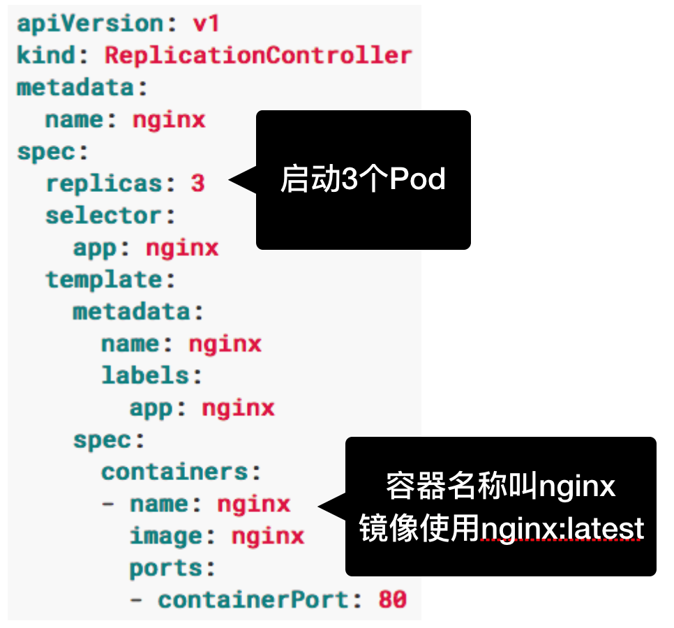

- Deployments -- 在Replication Controller上一层的对象, 它的工作内容是, 确保要启动的pod需要的资源是可用的, 比如Pod需要挂在的存储设备等, 当一切准备就绪后, 启动一个ReplicaSets(新一代的Replication Controller), 然后ReplicaSets来确保Pod的数量是用户定义的数量, 之后Deployments负责接收用户的更新来更新它所对应的ReplicaSets, 简单地讲用户不应该直接操作ReplicaSets, 而是通过Deployments来更新ReplicaSets, 下面就是一个Deployments的yaml定义文件:

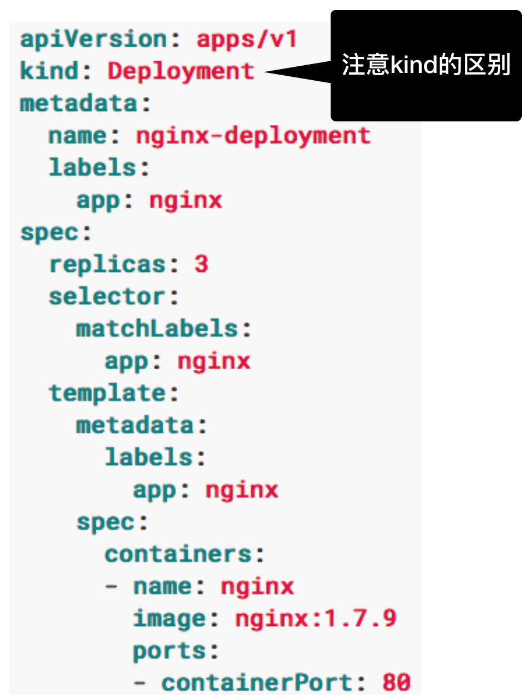

- DaemonSet -- 另一个Replication Controller它能确保通过它启动的Pod一定会启动在所有的k8s集群当中的节点上, 简单的将就是一个工作节点启动一个Pod, 它和Deployment模版差不多, 但是不用定义replicas字段.  

- StatefulSet -- 另一个Replication Controller, 和ReplicaSets不同, ReplicaSets启动Pod的时候部分限售的启动在各个工作节点上, 然后StatefulSet是依次启动Pod, 并且StatefulSet目前还是测试阶段, 有不少限制

### API Driven的软件设计

k8s是一个API Driven设计模式, 意思就是每个组件尽可能地单独开发, 如果是一个提供服务的组件, 那么所有的功能都通过Restful API暴露出来, 这样其他组件就可以很容易的调用这些API从而把一个一个单独的项目串联起来, 早期的OpenStack也是这样的设计思路.  

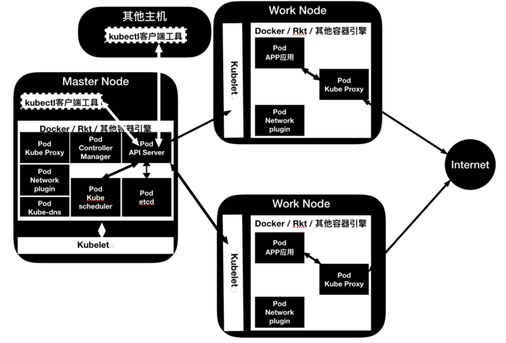

### 运行一个应用部署器(Deployment)的过程

结合下图讲解运行一个应用部署器的过程: 假设使用的Replication Controller是Deployment, 用命令`kubectl run nginx --image=nginx:latest --replicas=3`

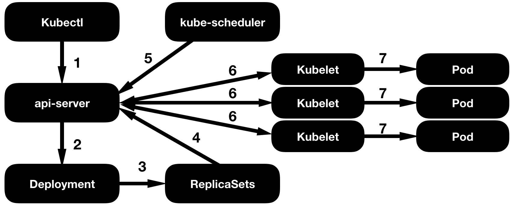
