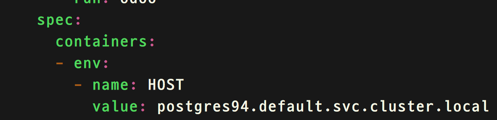

# Kubernetes 监控、日志收集与排错

一般一个平台的健壮程度很大程度依赖于预防性措施，要做预防措施，首先得收集到平台运行的状态，那么我们回到 k8s 中，我们需要对 k8s 节点的运行状态做一个监控，比如 CPU 百分比和内存使用量，还有我们需要收集 k8s 各个组件的日志等，但是目前 k8s 没有集中式的日志收集机制，收集汇总日志需要依赖于第三方的功能，同时监控实时性能也需要借助于第三方的组件，我们将在这一章中讨论日志收集和监控的主流解决方案，还会教大家一个基本的排错思路。

## Catalog

<!-- @import "[TOC]" {cmd="toc" depthFrom=1 depthTo=6 orderedList=false} -->

<!-- code_chunk_output -->

- [Kubernetes 监控、日志收集与排错](#kubernetes-%e7%9b%91%e6%8e%a7%e6%97%a5%e5%bf%97%e6%94%b6%e9%9b%86%e4%b8%8e%e6%8e%92%e9%94%99)
  - [Catalog](#catalog)
  - [日志监控解决方案](#%e6%97%a5%e5%bf%97%e7%9b%91%e6%8e%a7%e8%a7%a3%e5%86%b3%e6%96%b9%e6%a1%88)
  - [排错](#%e6%8e%92%e9%94%99)
    - [k8s 服务的排错](#k8s-%e6%9c%8d%e5%8a%a1%e7%9a%84%e6%8e%92%e9%94%99)
    - [应用的排错](#%e5%ba%94%e7%94%a8%e7%9a%84%e6%8e%92%e9%94%99)
  - [实验 -- 检查错误日志](#%e5%ae%9e%e9%aa%8c----%e6%a3%80%e6%9f%a5%e9%94%99%e8%af%af%e6%97%a5%e5%bf%97)
  - [实验 – 部署 heapster](#%e5%ae%9e%e9%aa%8c-%e2%80%93-%e9%83%a8%e7%bd%b2-heapster)
  - [实验 – etcd 数据的快照](#%e5%ae%9e%e9%aa%8c-%e2%80%93-etcd-%e6%95%b0%e6%8d%ae%e7%9a%84%e5%bf%ab%e7%85%a7)

<!-- /code_chunk_output -->

## 日志监控解决方案

- 监控 -- k8s 一般使用的第三方的监控组件是 Heapster, 它可以运行一个或多个 Pod 在 k8s 集群当中，它可以监测到所有的节点，并通过 kubelet 获取资源的用量，kubelet 的数据来自于 cAdvisor。它将 Pod 的数据分组汇总然后存入配置的后台数据库中，以便于查询或者展示，同时一些 k8s 的高级特性，比如 Pod 的自动扩容 (HPA) 都会依赖于监控数据。
- 日志收集 -- 日志的收集有助于我们解决生产当中遇到的问题，我们可以利用第三方的软件来做日志的收集，比如 Fluentd
- 日志+监控+报警 -- 如果大家觉得监控和日志分别实施比较麻烦的话，我们可以使用 Prometheus + Grafana，它提供时序数据库 (time series)，还能和 Grafana 集成用来展示数据库。同学们可以参考 [https://prometheus.io/](https://prometheus.io/) 来了解更多。


## 排错

### k8s 服务的排错

k8s 的服务比如 api-server 都是一个 Pod，我们可以通过 kubectl log 和 docker logs 来排查，但是更多的时候你会发现一旦修改了 apiserver 的 yaml 模版，整个 apiserver 的容器就会消失，然后再也找不到日志了，这个时候我们可以通过查看 master 节点上的 kubelet.service 服务来查看日志，比如 journalctl -u kubelet.service -f 来监控你的 kubelet 日志，所有提供服务的 Pod 都是静态的（没有 deployment) 直接被 kubelet 服务管理着，所以你可以通过查看 kubelet 的日志看到所有服务 Pod 的日志。

### 应用的排错

应用 Pod 的错误可能有很多，比如：无法下载镜像、volume 无法被挂载、需要访问的服务不存在等，这些我们都需要能及时查看到，我们可以通过 kubect logs [podID] 来查看日志，也可以通过 kubectl describe pod [Pod] 来查看详细，有一些需要登录到容器当中做诊断，我们可以通过 kubectl exec -it [podID] /bin/bash 来登录到容器中查看详细信息，比如诊断域名的解析你需要类似于 nslookup 这种工具，但问题是很多镜像的 base image 是轻量级的，它没有预先安装各种工具比如 dnsutils、telnet 还有 net-tools 等，如果我们 k8s 集群可以访问外网，问题就很好解决，直接安装 apt 或者 yum 即可，但是很多企业内部应用集群都是离线的，无法使用这些工具安装，这时我们可以用 busybox 这种瑞士军刀级别的 base image 重新打包应用，当然打包过程可以在有网络的个人电脑上完成，然后重新上传，这样就会有很多常用的命令行工具帮助我们来做必要的诊断。

## 实验 -- 检查错误日志

> 实验目的：和 19.4 的练习很像，我们要启动一个 postgres 数据库的 Pod 然后发布服务，然后再发布一个网站的服务，让网站的服务通过域名访问数据库服务的 5432 端口，不同的是网站的 Pod 会发生错误，我们要做的就是检查日志定位错误，然后解决问题。

```shell
# 启动 postgres 的 Pod, 并发布服务。
# 我们把发布服务和创建 deployment 写在一起一并创建
trystack@k8sMaster ~ $  kubectl create -f /home/trystack/course_lab/lab20-3/postgres.yaml
trystack@k8sMaster ~ $  kubectl get pods,svc
```


```shell
# 启动网站的 Pod, 并发布服务。
trystack@k8sMaster ~ $  kubectl create -f /home/trystack/course_lab/lab20-3/odoo.yaml
trystack@k8sMaster ~ $  kubectl get deployment,svc odoo
```


```shell
# 打开浏览器访问 http://10.0.0.100:30370
#然后我们会发现出错了
```


```shell
#检查网站服务的 Pod 的日志，odoo[tab 键]
#我们会看到 Name or service not known 的错误
#应该是数据库服务的域名无法被解析
trystack@k8sMaster ~ $  kubectl logs odoo-7b7f679fd6-qgj77
```


```shell
#我们可以利用 dig 命令来做反向解析
#我们之前知道数据库服务的 cluster ip 是 10.97.71.211@10.96.0.10，我们要从那个 dns server 进行反向解析
trystack@k8sMaster ~ $  dig -x 10.97.71.211 @10.96.0.10 +short
```


```shell
#我们现在知道正确的域名了，现在我们可以修改网站服务的信息
#修改 env 下的 HOST 的 value 为 postgres94.default.svc.cluster.local
trystack@k8sMaster ~ $ kubectl edit deployment odoo
```



```shell
#重新访问 http://10.0.0.100:30370 你会发现一切正常了
```

## 实验 – 部署 heapster

> 实验目的：很多 k8s 的功能度依赖于 heapster 这个组件，比如 kubectl top 命令是用来查看 Pod 的资源用量的，当你没有部署 heapster 的时候，这个命令是不工作的，又比如后面要讲述的 HPA 功能等等，所以在这个实验中我们要部署 heapster

```shell
#加载 heapster 需要使用的 docker 镜像。
trystack@k8sMaster ~ $  sudo -s
root@k8sMaster ~ $ docker load -i k8s.gcr.io^heapster-amd64.tar
root@k8sMaster ~ $ docker tag f57c75cd7b0a k8s.gcr.io/heapster-amd64:v1.5.3
root@k8sMaster ~ $ docker load -i k8s.gcr.io^heapster-grafana-amd64.tar
root@k8sMaster ~ $ docker tag 8cb3de219af7 k8s.gcr.io/heapster-grafana-amd64:v4.4.3
root@k8sMaster ~ $ docker load -i k8s.gcr.io^heapster-influxdb-amd64.tar
root@k8sMaster ~ $ docker tag 577260d221db k8s.gcr.io/heapster-influxdb-amd64:v1.3.3
root@k8sMaster ~ $ exit
#创建 grafana 展示界面的 Pod 并且发布服务
trystack@k8sMaster ~ $ kubectl create -f \
trystack@k8sMaster ~ $ /home/trystack/course_lab/heapster/grafana.yaml
#创建 heapster 需要使用的 service account 和 cluster role
trystack@k8sMaster ~ $ kubectl create -f \
trystack@k8sMaster ~ $ /home/trystack/course_lab/heapster/heapster-rbac.yaml
#创建 heapster 需要使用的数据库 influxdb，并发布服务
trystack@k8sMaster ~ $ kubectl create -f \
trystack@k8sMaster ~ $ /home/trystack/course_lab/heapster/influxdb.yaml
#创建 heapster Pod 并发布服务
trystack@k8sMaster ~ $ kubectl create -f \
trystack@k8sMaster ~ $ /home/trystack/course_lab/heapster/heapster.yaml
#查看服务
trystack@k8sMaster ~ $ kubectl get svc -n kube-system
```


```shell
#访问 grafana 展示界面，浏览器打开 http://10.0.0.100:30948
```


```shell
#使用 top 命令查看 Pod 的资源用量
trystack@k8sMaster ~ $ kubectl top pod -n kube-system
```


## 实验 – etcd 数据的快照

> 实验目的：k8s 大部分持久化的数据比如集群信息 service account 这些资源都是存放在 etcd 数据库当中的，对 etcd 的数据进行定期的备份就变得很重要，在这个屎样当中我们将要备份 etcd 数据库，我们会使用 etcdctl 工具这个工具在 k8smaster 节点上的/home/trystack/etcd-v3.3.5-linux-amd64 目录下，因为我们 etcd 使用的是 https 协议，所以我们使用这个工具的时候也要把证书传入到这个工具中去，才能正确的对 etcd 数据库做操作。

```shell
#根据 etcd 的静态 Pod 去查看 etcd 使用的各种证书文件
```


```shell
#进入 etcdctl 工具所在的目录
trystack@k8sMaster ~ $ cd etcd-v3.3.5-linux-amd64/
#切换到 root 因为证书是在/etc/kubernetes/pki 目录下的普通用户没权限
trystack@k8sMaster ~ etcd-v3.3.5-linux-amd64/ $ sudo -s
root@k8sMaster ~ etcd-v3.3.5-linux-amd64/ $ sudo -s
#使用 v3 版本的 etcdctl, 这样才有 snapshot 这样的命令
root@k8sMaster ~ etcd-v3.3.5-linux-amd64/ $ export ETCDCTL_API=3
#为 etcd 数据库做快照方便回滚，如果 etcd 数据是在本地的话可以缺省--endpoints
root@k8sMaster ~ etcd-v3.3.5-linux-amd64/ $ ./etcdctl \
root@k8sMaster ~ etcd-v3.3.5-linux-amd64/ $ --cacert="/etc/kubernetes/pki/etcd/ca.crt" \
root@k8sMaster ~ etcd-v3.3.5-linux-amd64/ $ --cert="/etc/kubernetes/pki/etcd/healthcheck-client.crt" \
root@k8sMaster ~ etcd-v3.3.5-linux-amd64/ $ --key="/etc/kubernetes/pki/etcd/healthcheck-client.key" \
root@k8sMaster ~ etcd-v3.3.5-linux-amd64/ $ snapshot save /home/trystack/etcd-db-snapshot
```


