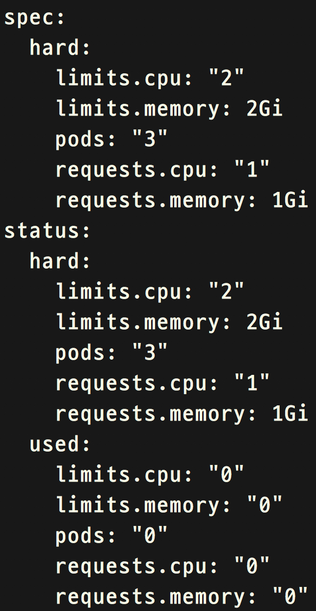

# Kubernetes 资源控制

k8s 底层主要编排的是容器，容器的资源使用量可以被 cgroup 来管理，k8s 就是利用 cgroup 来限制容器资源的使用，并且可以针对一个 namespace 设置配额，但是使用前需要确保你的启动 api-server 在 --admission-control 参数后面有 ResourceQuota

## Catalog

<!-- TOC -->

- [Kubernetes 资源控制](#kubernetes-%e8%b5%84%e6%ba%90%e6%8e%a7%e5%88%b6)
  - [Catalog](#catalog)
  - [namespace](#namespace)
  - [配额Quota](#%e9%85%8d%e9%a2%9dquota)
  - [Pod的资源限制](#pod%e7%9a%84%e8%b5%84%e6%ba%90%e9%99%90%e5%88%b6)
  - [实验--创建一个namespace](#%e5%ae%9e%e9%aa%8c--%e5%88%9b%e5%bb%ba%e4%b8%80%e4%b8%aanamespace)
  - [实验--控制namespace的配额](#%e5%ae%9e%e9%aa%8c--%e6%8e%a7%e5%88%b6namespace%e7%9a%84%e9%85%8d%e9%a2%9d)

<!-- /TOC -->

## namespace

namespace 你可以把它看成一个组或者一个租户，k8s 中几乎所有的资源都可以划分到一个一个 namespace 下，k8s 默认会为我们建立几个 namespace，他们是：kube-system、default、kube-public。

## 配额Quota

当把 k8s 放在公有云的环境中考虑，每个 namespace 就是一个租户，默认每个 namespace 下的资源使用量是没有限制的，但是你的物理资源是有上限，而且需要保证容器运行时能够获取到足够的资源 (cpu、memory)，这时我们就需要对 namespace 进行资源的限制，我们可以通过对 namespace 设置配额来达到控制资源的目的，但是配额除了可以限制 cpu 和 memory 之外还可以限制其他数据比如：Pod 数量、磁盘数量、对象数量等，课程中我们只会简单限制 cpu、 memory 资源，当然你可以查看 [这里](https://kubernetes.io/docs/concepts/policy/resource-quotas/) 来了解更多信息。

## Pod的资源限制

资源的限制最终是落在 Pod 下的容器中的，我们可以通过在 yaml 文件里的定义来限制 Pod 下的容器对 cpu 和 memory 的使用量

## 实验--创建一个namespace

> 实验目的：创建一个 namespace 在下个实验中用来做配额的限制。

```shell
trystack@k8sMaster ~ $  kubectl create ns quota-ns
#列出 namespace，你应该可以看到刚才创建 namespace
trystack@k8sMaster ~ $  kubectl get ns
```

## 实验--控制namespace的配额

> 实验目的：为之前创建的 namespace 设置资源配额，来限制他资源的使用，但是需要注意的是一旦你的 namespace 设置了配额，之后在这个 namespace 里启动的 pod 都必须指定，配额一般可以从 2 个角度来限制：硬件、逻辑（比如允许几个 Pod、PV 等），建议大家了解一下 docker 的资源控制，可以访问这里查看[详细](https://docs.docker.com/engine/reference/run/#cpu-share-constraint)

```shell
#创建一个配额 (quota), 同时绑定到 quota-ns 这个 namespace 上
trystack@k8sMaster ~ $  kubectl create -f /home/trystack/course_lab/lab16-5/quota_demo --namespace=quota-ns
#查看 quota-ns 的配额使用量，-o 表示输出的格式，你可以看到用量都是 0
trystack@k8sMaster ~ $  kubectl get resourcequota quota-demo -n quota-ns -o yaml
```



```shell
#创建一个 pod 在 quota-ns 这个 namespace 下
trystack@k8sMaster ~ $  kubectl create -f /home/trystack/course_lab/lab16-5/quota-pod1 -n quota-ns
#创建第二个 pod 在 quota-ns 这个 namespace 下
#不成功是因为超过了 cpu 的配额
trystack@k8sMaster ~ $  kubectl create -f /home/trystack/course_lab/lab16-5/quota-pod2 -n quota-ns
#同学们可以通过修改配额，来成功创建第二个 Pod，但是第三个 Pod 不能创建
#超过了 pod 的配额了，这里就不再演示。
```
