# Kubernetes 调度

k8s 集群中有很多节点，每个节点的物理服务器的性能也不同，为了达到类似于云计算 availability zone（可用域/硬件资源划分）的功能，我们需要有效的手段来控制我们的 Pod 正确的调度到我们想要的或者自动分配到合理的工作节点上，负责调度的算法的组件叫做 kube scheduler, 而且集群当中可以有多个 scheduler 可以参看这里来了解在集群中有多 scheduler 的场景下的 [安装和使用](https://kubernetes.io/docs/tasks/administer-cluster/configure-multiple-schedulers/)

## Catalog

<!-- @import "[TOC]" {cmd="toc" depthFrom=1 depthTo=6 orderedList=false} -->

<!-- code_chunk_output -->

- [Kubernetes 调度](#kubernetes-%e8%b0%83%e5%ba%a6)
  - [Catalog](#catalog)
  - [Labels 标签](#labels-%e6%a0%87%e7%ad%be)
  - [Taints--污染标签](#taints--%e6%b1%a1%e6%9f%93%e6%a0%87%e7%ad%be)
  - [Toleration--容忍](#toleration--%e5%ae%b9%e5%bf%8d)
  - [Node Affinity 节点亲和 (beta/beta 测试）](#node-affinity-%e8%8a%82%e7%82%b9%e4%ba%b2%e5%92%8c-betabeta-%e6%b5%8b%e8%af%95)
  - [Inter-Pod Affinity/Anti Pod 的亲和/反亲和 (beta/beta 测试）](#inter-pod-affinityanti-pod-%e7%9a%84%e4%ba%b2%e5%92%8c%e5%8f%8d%e4%ba%b2%e5%92%8c-betabeta-%e6%b5%8b%e8%af%95)
  - [实验--为 Pod 和节点打上标签](#%e5%ae%9e%e9%aa%8c--%e4%b8%ba-pod-%e5%92%8c%e8%8a%82%e7%82%b9%e6%89%93%e4%b8%8a%e6%a0%87%e7%ad%be)
  - [实验—通过 lable 批量操作对象](#%e5%ae%9e%e9%aa%8c%e9%80%9a%e8%bf%87-lable-%e6%89%b9%e9%87%8f%e6%93%8d%e4%bd%9c%e5%af%b9%e8%b1%a1)
  - [实验--为节点 Taints、Pod 的 Toleration](#%e5%ae%9e%e9%aa%8c--%e4%b8%ba%e8%8a%82%e7%82%b9-taintspod-%e7%9a%84-toleration)
  - [实验--Node Affinity/节点亲和](#%e5%ae%9e%e9%aa%8c--node-affinity%e8%8a%82%e7%82%b9%e4%ba%b2%e5%92%8c)
  - [实验--Pod Affinity/Anti Affinity 节点亲和/反亲和](#%e5%ae%9e%e9%aa%8c--pod-affinityanti-affinity-%e8%8a%82%e7%82%b9%e4%ba%b2%e5%92%8c%e5%8f%8d%e4%ba%b2%e5%92%8c)

<!-- /code_chunk_output -->

## Labels 标签

我们可以通过标签的方式来标注每个资源，包括节点、Pod 还有其他各种资源都可以打上标签，这样方便我们以标签的方式来管理资源，包括后面要叙述的 Pod 的调度都依赖于这些标签，我们将专注于 Pod 和节点的标签，标签无非就是一对 [key]:[value] 的键值对，我们很容易能操作它。注意 kubernetes.io 是系统预留给节点的，请不要用在 Pod 上，预留的标签有：

```shell
- beta.kubernetes.io/arch
- beta.kubernetes.io/os
- kubernetes.io/hostname
- beta.kubernetes.io/instance-type
- failure-domain.beta.kubernetes.io/region
- failure-domain.beta.kubernetes.io/zone
```

## Taints--污染标签

它是特殊的一种标签，也是我们课程开始安装 k8s 时操作过的标签，它的作用为标注一个节点，让 Pod 的调度算法避免在这个被标注为污染的节点上启动 Pod，除非 Pod 定义当中有 Toleration（容忍），Taints 是可以叠加的，它有以下三种等级他们分别是：

- NoScheduler -- Pod 不会调度到这个节点上除非有 Toleration
- PerferNotScheduler -- 调度算法会尽可能避免这个节点除非没有其他可以的节点了。
- NoExcute/自动驱逐 (beta/beta 测试） -- 目前还是测试功能，它会强制运行在这个节点上的 Pod 被强行迁移走（对强拆）。

## Toleration--容忍

它是特殊的一种标签，它的作用是让 Pod 的调度忽略节点上的 Taints 标签，有点像反 Taints 的作用，他们之间组合起来一起使用的场景是，让一个节点上运行一些特殊的 Pod 比如 k8s 依赖的 Pod，其他一些 app 的 Pod 不运行在这个节点上。

## Node Affinity 节点亲和 (beta/beta 测试）

Pod 最终是通过运行一个程序来提供服务的，服务一般需要有高可用，那么我们的场景是启动多个 Pod，但是这些 Pod 应该尽可能不启动在同一个节点上，防止因为节点故障导致服务不可用，所以我们需要一种合理的方法来控制 Pod 的调度，大部分的调度控制都是通过 label 来完成的。

- Node Selector -- 节点选择器，是最简单的控制 Pod 调度的方法之一，只要在 yaml 文件中显式制定 Pod 启动的节点即可。如下图就是 Pod 启动时选择一个节点，必须有一个标签的键为 disktype，值为 ssd。  

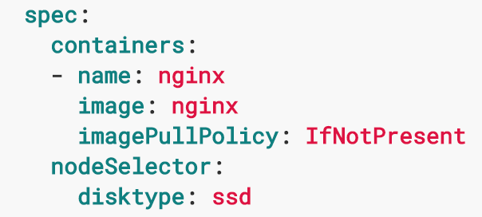

- Node Affinity -- 通过 Pod 的 yaml 定义文件在 nodeAffinity 下指定具体的行为：
  - requiredDuringSchedulingIgnoredDuringExecution：一定要在计算调度算法的时候找到匹配下方表达式的节点，否则 Pod 不能启动，Pod 一旦运行，规则立刻失效。
  - preferredDuringSchedulingIgnoredDuringExecution：最好在计算调度算法的时候找到匹配下方表达式的节点，否则随便找一个节点启动，Pod 一旦运行，规则立刻失效。
  - preferredDuringSchedulingRequiredDuringExecution（未实现的功能）和 requiredDuringSchedulingIgnoredDuringExecution 一样，唯一的区别在于，Pod 运行时，这个规则也生效。  
    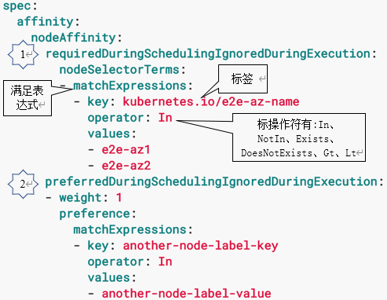

## Inter-Pod Affinity/Anti Pod 的亲和/反亲和 (beta/beta 测试）

之前我们讲解节点的亲和和反亲和，我们接下来要讲解一下 Pod 的亲和和反亲和。和节点亲和不一样，节点的亲和是专注于节点的标签，而 Pod 的亲和是关注于已经启动着的 Pod 的标签，也是比较实用的功能，它的结构和刚才一样，只不过把原本 nodeAffinity 换成了 podAffinity, 而且需要指定 topologyKey，它用来指定节点的标签，官方不建议在 1000 个节点以上的 k8s 集群使用 Pod 亲和/反亲和，这样会大大减缓调度算法的效率。

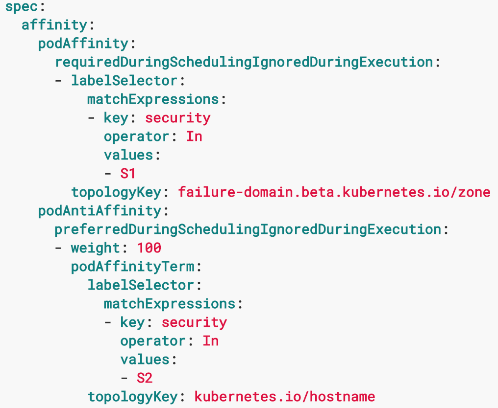

## 实验--为 Pod 和节点打上标签

> 实验目的：为节点打上一些标签，以便在后面的调度和标签管理的练习中起作用。

```shell
#查看节点上的现有标签
trystack@k8sMaster ~ $  kubectl get nodes --show-labels
```

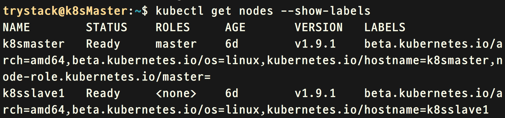

```shell
#为 master 节点和 slave1 节点打上标签
trystack@k8sMaster ~ $  kubectl label node k8smaster kubernetes.io/region1-az-hpc=""
trystack@k8sMaster ~ $  kubectl label node k8sslave1 kubernetes.io/region1-az-app=""
trystack@k8sMaster ~ $  kubectl label node k8smaster userless="true"
#删除一个 label 方法就是在最后打上减号 (-)
trystack@k8sMaster ~ $  kubectl label node k8smaster userless-
#启动 2 个 Pod
trystack@k8sMaster ~ $  kubectl create -f /home/trystack/course_lab/lab17-6/first_pod.yaml
trystack@k8sMaster ~ $  kubectl create -f /home/trystack/course_lab/lab17-6/second_pod.yaml
#为 2 个 Pod 打上相同的标签
trystack@k8sMaster ~ $  kubectl label pod nginx1 batch="1"
trystack@k8sMaster ~ $  kubectl label pod nginx2 batch="1"
```

## 实验—通过 lable 批量操作对象

> 实验目的：通过标签批量操作，比如删除 Pod 等等。

```shell
#查看 Pod 现有标签
trystack@k8sMaster ~ $  kubectl get pod --show-labels
```

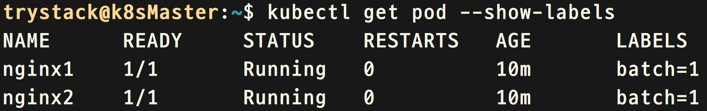

```shell
#删除所有标签 batch=1 的 Pod
trystack@k8sMaster ~ $  kubectl delete pods -l batch=1
```

## 实验--为节点 Taints、Pod 的 Toleration

> 实验目的：为一个节点打上 Taints 标签，然后试着创建 2 个 Pod，你会发现 Pod 不会调度到有 Taints 的节点上，然后启动一个有 Toleration 的 Pod 看一下会有什么效果。

```shell
#为 master 节点添加 Taints, 注意 mykey 和 myvalue 可以是任何的合法字符
#NoSchedule 是具体的行为，Pod 不会被调度到这个节点上
trystack@k8sMaster ~ $  kubectl taint node k8smaster mykey=myvalue:NoSchedule
#启动 3 个 Pod
trystack@k8sMaster ~ $  kubectl create -f /home/trystack/course_lab/lab17-8/first_pod.yaml
trystack@k8sMaster ~ $  kubectl create -f /home/trystack/course_lab/lab17-8/second_pod.yaml
trystack@k8sMaster ~ $  kubectl create -f /home/trystack/course_lab/lab17-8/third_pod.yaml
#查看 Pod 的情况，-o wide 表示追加显示 IP 和 NODE 列
#Pod 不会启动在任何节点上，因为我们在模版当中添加了 nodeSelector
#并且选择了 kubernetes.io/hostname: k8smaster
#然而 k8smaster 是有 Taints 标签的，所以 Pod 就一直 pending 在那里
trystack@k8sMaster ~ $  kubectl get pods  
```

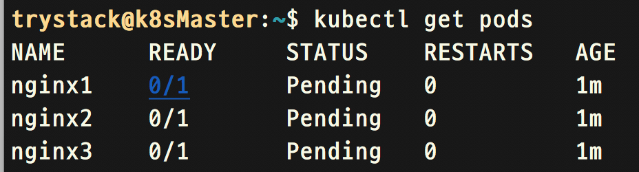

```shell
#修改 nginx1、nginx2、nginx3 的定义文件并删除 nodeSelector
trystack@k8sMaster ~ $  sed -i '/nodeSelector/,+1 d' /home/trystack/course_lab/lab17-8/first_pod.yaml
trystack@k8sMaster ~ $  sed -i '/nodeSelector/,+1 d' /home/trystack/course_lab/lab17-8/second_pod.yaml
trystack@k8sMaster ~ $  sed -i '/nodeSelector/,+1 d' /home/trystack/course_lab/lab17-8/third_pod.yaml
#删除现有 Pod
trystack@k8sMaster ~ $  kubectl delete pod nginx1
trystack @k8sMaster ~ $  kubectl delete pod nginx2
trystack @k8sMaster ~ $  kubectl delete pod nginx3
#重新创建 pod，你会发现 Pod 都已经运行了
trystack@k8sMaster ~ $  kubectl create -f /home/trystack/course_lab/lab17-8/first_pod.yaml
trystack@k8sMaster ~ $  kubectl create -f /home/trystack/course_lab/lab17-8/second_pod.yaml
trystack@k8sMaster ~ $  kubectl create -f /home/trystack/course_lab/lab17-8/third_pod.yaml
```

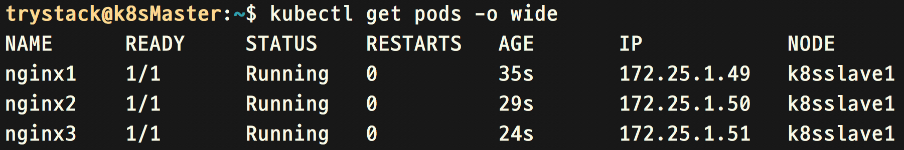

```shell
#创建一个有 Toleration 的 Pod
trystack@k8sMaster ~ $  kubectl create -f /home/trystack/course_lab/lab17-8/anti-taints_pod.yaml
#查看 Pod 的情况，我们发现这个 Pod 启动在了有 Taints 标签的 k8smaster 节点上
trystack@k8sMaster ~ $  kubectl get pods -o wide
```

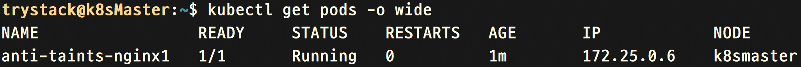

```shell
#通过标签删除 Pod
trystack@k8sMaster ~ $ kubectl delete pod -l affinity_demo=demo
trystack@k8sMaster ~ $ kubectl delete pod anti-taints-nginx1
#删除 k8smaster 节点的 Taints 标签
trystack@k8sMaster ~ $ kubectl taint node k8smaster mykey-
```

## 实验--Node Affinity/节点亲和

> 实验目的：我们之前给大家演示了 nodeSelector，接下去我们要给大家演示一下节点亲和 Affinity。

```shell
#为 k8smaster 打上标签
trystack@k8sMaster ~ $ kubectl label node k8smaster region-china/zone1=
#启动 Pod
trystack@k8sMaster ~ $ kubectl create -f course_lab/lab17-9/node_affinity.yaml
#我们看到这个 Pod 启动在 k8smaster 节点上
```

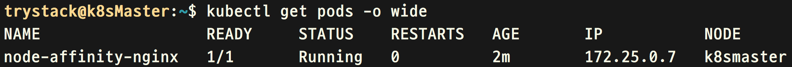

## 实验--Pod Affinity/Anti Affinity 节点亲和/反亲和

> 实验目的：在这个章节当中我们要演示 Pod 的亲和/反亲和能力，我们要添加 podAffinity 使 Pod 启动的时能够找到另一个已经运行着的 Pod 的标签，从而避免启动在同一节点上。  
> 参与演示的 Pod 有：1 个数据库 Pod、2 个 web 服务的 Pod，其中一个 web 服务的 Pod 要和数据库 Pod 启动在一起，2 个 web 服务的 Pod 一定不能启动在一起。

```shell
#为 k8sslave1 节点打上标签
trystack@k8sMaster ~ $ kubectl label node k8sslave1 region-china/zone2=
#启动第一个数据库的 Pod，这个 Pod 有 nodeSelector 指向了 k8smaster
trystack@k8sMaster ~ $ kubectl create -f /home/trystack/course_lab/lab17-10/pod_affinity_db.yaml
#启动第一个 web 服务的 Pod, 它会和之前的 db 启动在一起，因为有亲和设置
trystack@k8sMaster ~ $ kubectl create -f /home/trystack/course_lab/lab17-10/pod_affinity_webserver1.yaml
trystack@k8sMaster ~ $ kubectl get pods -o wide
```

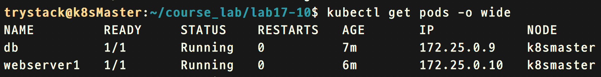

```shell
#启动第二个 web 服务的 Pod, 它不会和 webserver1 启动在一起，因为反亲和设置
trystack@k8sMaster ~ $ kubectl create -f /home/trystack/course_lab/lab17-10/pod_affinity_webserver2.yaml
trystack@k8sMaster ~ $ kubectl get pods -o wide
```

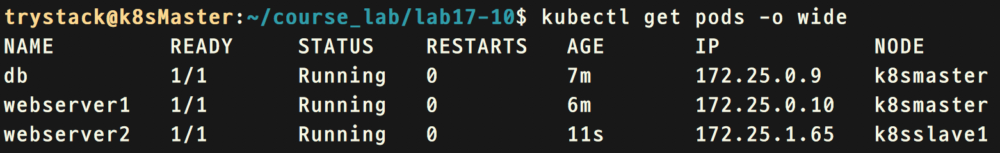
