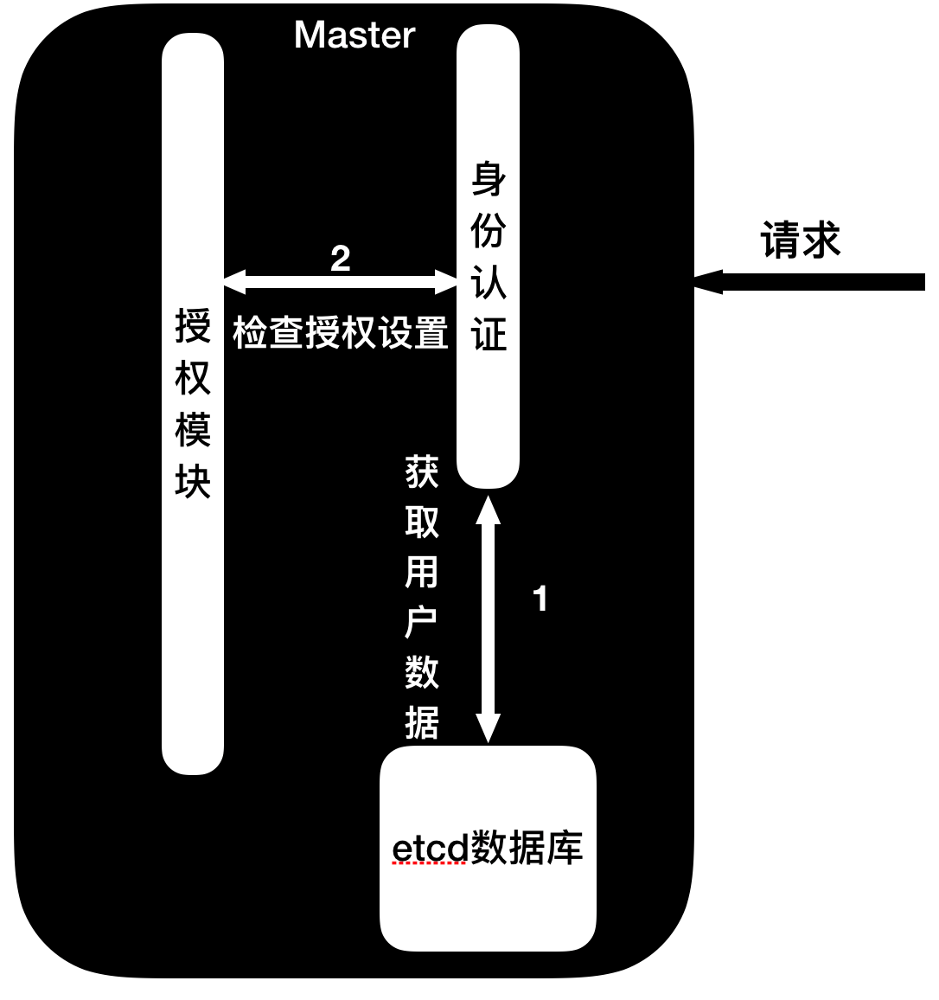

# Kubernetes的安全

本章讲解 k8s 解决方案，比如: Pod 的安全、api-server 访问的机制、pod 之间网络安全的问题等。

## Catalog

<!-- TOC -->

- [Catalog](#catalog)
- [API的认证过程](#api的认证过程)
- [Pod的安全](#pod的安全)
- [Pod的网络安全](#pod的网络安全)
- [实验-创建普通用户并使用kubectl工具](#实验-创建普通用户并使用kubectl工具)
- [实验-创建Normal用户并给予超级管理员组](#实验-创建normal用户并给予超级管理员组)
- [实验-创建Service Account并绑定角色](#实验-创建service-account并绑定角色)

<!-- /TOC -->

## API的认证过程

之前讨论过k8s的设计思路是 API Driven，组件通信都是经过API来协调的，换句话说所有的https/http请求都要经过 api-server 那么 api-server 如何建立起安全的授权通信机制就变的非常重要了，否则很容易被人攻击。

接下来的时间要讨论一下，k8s 是如何处理一个 https/http 请求,请求又是如何通过层层认证到最后执行相关操作的呢？请求要经过三个步骤:身份认证、授权模块和接纳控制。


- 身份认证(authentication) -- 讲到身份认证就要讲起用户，在k8s中有2种用户:
  - 服务用户(service account) -- 服务用户是内置在k8s的架构下的，本意是给pod和api-server之间通信的账号。  
  - 普通账号(Normal user) -- 普通用户不受k8s来管理，一般由外部系统管理，可以是第三方的系统来管理的。  
    > 身份认证有很多种认证方式，我们的课程当中会挑常用的给大家讲解: X509 Client Certs、 Static Token File、 Service Account Tokens，当然除此之外还有很多种，我们在这里就不一一讲解了，同学们可以访问[这里](https://kubernetes.io/docs/admin/authentication/)来查看更多关于authentication的信息。  
  - X509 Client Certs -- 默认启用的身份认证机制(TLS)，是通过用户的身份种子(key),通过master节点的ca证书和ca证书的种子生产出用户的证书。然后把证书写到当前用户.kube/config文件下就可以让kubectl命令行工具和api-server通信了。  
    

  - Static Token File -- 静态认证文件，简单的说就是在api-server启动时把一个可以访问api-server的用户列表给到api-server，然后用户通过在这个列表中的token(bearer token)放在http请求当中就可以访问api-server了，这种方式不是很灵活，所以一般不会启动这种模式。  
    
  - Service Account Token -- 默认开启的认证方式，之前提到有两种用户，其中一种就是service account，每个service account创建的时候，k8s都会自动生成一个经过签名的token，签名文件可以在启动api-server时通过--service-account-key-file传入，通过这个token就可以访问api-server了。  
- 授权模块 (Authorization) -- 我们刚才谈到了，如何通过k8s身份认证的各种机制，但那只是第一步，如果没有定义合适的权限，就算通过认证也无法访问特定的功能，这个就是由授权模块(Authorization)来控制的，授权模块的机制也有多种比如: ABAC(基于属性授权)、RBAC(基于角色授权)、Node(基于节点)、Webhook模式，课程当中主要围绕RBAC来展开。  

  - ABAC(Attribute-based access control) -- 基于属性的授权方式，一般不会开启，默认k8s使用的是RBAC和Node的认证方式，如果想开启请在api-server启动时把--authorization-mode=ABAC，但是不建议这么做，课程不做详解，如果需要请查看[这里](https://kubernetes.io/docs/admin/authorization/abac/) 来了解ABAC的使用方式。  
  - RBAC(Role-based access control) -- 基于角色的授权管理，也是k8s默认开启和推荐的一种模式，设计思路是无论服务账号(service account)还是普通用户(Normal User),都可以赋予各种权限，比如能够列出Pod但不能创建pod，这种具体的动作都和一个角色绑定，最终一个用户绑定到一个或多个角色上来实现授权,需要注意的是角色(role)分为:role(分namespace)、cluster role(不分namespace或者是说是集群级别的)，然后角色通过Binding(绑定)对象绑定到用户或者组，Binding对象分为RoleBinding和ClusterRoleBinding。  
    
  - Node -- 一定需要开启的机制，它的用途比较特殊，是给kubelet和api-server通信的，一般没有特殊情况我们不会去修改。  
  - WebHook -- 默认不开启，它的作用是在用户通过身份认证后，去外部地址获取这个用户的授权模块，一般在和其他程序集成的时候使用。  
    
- 接纳控制 (admission controller) -- admission controller在身份认证和模块授权之后，可以执行一些强制措施，比如用户启动Pod时定义镜像的策略为IfNotPresent（如果镜像已存在就不需要下载），管理员可以通过特定的admission controller去强制每次都下载新的镜像。我们在api-server启动时可以指定启动哪些admission controller，比如kube-apiserver --admission-control=Initializers，NamespaceLifecycle，LimitRanger，我们可以查看这里来学习每个admission controller的作用：[https://kubernetes.io/docs/admin/admission-controllers/#what-are-they](https://kubernetes.io/docs/admin/admission-controllers/#what-are-they)  

## Pod的安全

Pod的安全涉及到容器运行时的权限和各种安全机制，这个功能依赖于 admission controller，默认不会打开，我们可以通过 --admission-control=PodSecurityPolicy 来开启，我们看下常用的有哪些：  

- Privileged -- 指定Pod(容器)运行时是否使用超级模式(docker run --privileged)  
- runAsUser -- 指定Pod(容器)运行时的用户  
- fsGroup -- 指定Pod(容器)运行时的fsGroup值，方便Pod区分块存储设备的归属。  
- seLinux -- 指定Pod(容器)的seLinux策略。  


## Pod的网络安全

默认Pod之间是可以互相访问的，特别是在早期应用场景局限于在企业内网中提供服务时，所以并没有考虑 Pod 之间的网络隔离，但是随着 k8s 的发展，容器公有云的场景应运而生，所以 Pod 之间的网络隔离变得尤为重要，这取决于当时搭建 k8s 时网络组件的选型，如果你搭建集群时使用了 flannel，下面的NetworkPolicy就不会起作用。


## 实验-创建普通用户并使用kubectl工具

> 实验目的:  我们将要建立一个新的普通用户(Normal User)，然后再创建2个新的namespace，然后把新的用户设置到其中一个namespace当中，让用户只能在一个namespace中操作。

```shell
#登录master节点
root@host ~ $  ssh trystack@10.0.0.100
#查看当前用户
trystack@k8sMaster ~ $  kubectl config get-contexts
#注意到当前的用户是kubernetes-admin，kubectl工具读取当前用户下的 .kube/config 文件来获取当前用户的信息
```


```shell
#创建2个namespace
trystack@k8sMaster ~ $  kubectl create namespace ns1
trystack@k8sMaster ~ $  kubectl create namespace ns2

#为了更好的实验效果，我们可以创建一个Linux 用户poweruser
trystack@k8sMaster ~ $  sudo -s
root@k8sMaster ~ $  useradd -m -d /home/poweruser -s /bin/bash poweruser
#设置密码为trystack
root@k8sMaster ~ $  passwd poweruser
root@k8sMaster ~ $  cd /home/poweruser
#创建一个加密的种子文件
root@k8sMaster ~ /home/poweruser $  openssl genrsa -out poweruser.key 2048
#生成一个待签名文件(csr)，注意O=ns1代表它的组不是namespace
root@k8sMaster ~ /home/poweruser $  openssl req -new -key poweruser.key -out poweruser.csr -subj "/CN=poweruser/O=ns1"
#用k8s的ca文件来签名这个csr,最终产生一个有效期为60天的证书文件
root@k8sMaster ~ /home/poweruser $  openssl x509 -req -in poweruser.csr -CA /etc/kubernetes/pki/ca.crt -CAkey /etc/kubernetes/pki/ca.key -CAcreateserial -out poweruser.crt -days 60
#修改文件权限让所有人可读写操作
root@k8sMaster ~ /home/poweruser $  chmod 777 poweruser.key
root@k8sMaster ~ /home/poweruser $  chmod 777 poweruser.csr
root@k8sMaster ~ /home/poweruser $  chmod 777 poweruser.crt
root@k8sMaster ~ /home/poweruser $  cd
#修改.kube/config文件,会自动添加一个用的配置项在.kube/config文件中
root@k8sMaster ~ $  kubectl config set-credentials poweruser \
root@k8sMaster ~ $  --client-certificate=/home/poweruser/poweruser.crt \
root@k8sMaster ~ $  --client-key=/home/poweruser/poweruser.key
#复制.kube/config文件到/home/poweruser/.kube目录下
root@k8sMaster ~ $  mkdir /home/poweruser/.kube
root@k8sMaster ~ $  cp .kube/config /home/poweruser/.kube
root@k8sMaster ~ $  chown -R poweruser:poweruser \
root@k8sMaster ~ $  /home/poweruser/.kube
#切换用户到poweruser
root@k8sMaster ~ $  su poweruser
poweruser@k8sMaster ~ /home/trystack $  cd  
#修改/home/poweruser/.kube/config文件
poweruser@k8sMaster ~ $  vim .kube/config
#删除下方用虚线框起来的内容
#根据图片提示修改
# user: poweruser
# name: poweruser@kubernetes
# current-context: poweruser@kubernetes
```


```shell
#运行kubectl命令,你会发现无法工作,会出现Forbidden的错误  
#那是正常的，因为我们没有绑定合适的权限给到这个用户
poweruser@k8sMaster ~ $  kubectl get pods
#切换到trystack用户
poweruser@k8sMaster ~ $  exit  
root@k8sMaster ~ $  exit
#创建一个role叫做powerrole
trystack@k8sMaster ~ $  kubectl create -f  \
trystack@k8sMaster ~ $  /home/trystack/course_lab/lab14-4/power-role.yaml
#创建一个rolebinding叫做powerrolebinding
trystack@k8sMaster ~ $  kubectl create -f  \
trystack@k8sMaster ~ $  /home/trystack/course_lab/lab14-4/power-role-binding.yaml
#检验一下效果
trystack@k8sMaster ~ $  su poweruser #密码trystack
#可以运行以下命令，返回结果为：No resources found.
poweruser@k8sMaster ~ $  kubectl get pods -n ns1  
#无法操作没有创建Pod的权限,运行下面的命令会出错
poweruser@k8sMaster ~ $  kubectl create -f \
poweruser@k8sMaster ~ $  /home/trystack/course_lab/lab14-4/first_pod.yaml
```

## 实验-创建Normal用户并给予超级管理员组

> 实验目的：这次我们的目的是创建一个普通用户，然后直接通过 Group (组)来绑定它的权限，我们的目标是要绑定默认的超级角色 cluster-admin。

```shell
#登录master节点
root@host ~ $  ssh trystack@10.0.0.100
#查看当前用户
trystack@k8sMaster ~ $  kubectl config get-contexts

```


```shell
#这次我们为了省点时间，我们不会再次在Linux中创建一个用户了
#直接创建一个普通用户
trystack@k8sMaster ~ $  openssl genrsa -out superuser.key 2048
#生成一个待签名文件(csr)，注意O= system:masters代表它组
trystack@k8sMaster ~ $  openssl req -new -key superuser.key \
trystack@k8sMaster ~ $  -out superuser.csr \
trystack@k8sMaster ~ $  -subj  "/CN= superuser /O=system:masters"
#用k8s的ca文件来签名这个csr,最终产生一个有效期为60天的证书文件
trystack@k8sMaster ~ $ sudo openssl x509 -req -in superuser.csr \
trystack@k8sMaster ~ $  -CA /etc/kubernetes/pki/ca.crt \
trystack@k8sMaster ~ $  -CAkey /etc/kubernetes/pki/ca.key \
trystack@k8sMaster ~ $  -CAcreateserial -out superuser.crt -days 60
trystack@k8sMaster ~ $  kubectl config set-credentials superuser \
trystack@k8sMaster ~ $  --client-certificate=/home/trystack/superuser.crt \
trystack@k8sMaster ~ $  --client-key=/home/trystack/superuser.key
#查看.kube/config配置文件
trystack@k8sMaster ~ $  tail .kube/config
```


```shell
#然后创建一个context
trystack@k8sMaster ~ $  kubectl config set-context superuser-context \
trystack@k8sMaster ~ $  --cluster=kubernetes --user=superuser
#查看context
trystack@k8sMaster ~ $  kubectl config get-contexts
```


```shell
#设置superuser为当前使用的context(环境身份文件)
trystack@k8sMaster ~ $  kubectl config use-context superuser-context
#查看context
trystack@k8sMaster ~ $  kubectl config get-contexts
```


```shell
#来搞点破坏
trystack@k8sMaster ~ $  kubectl delete pod nginx
trystack@k8sMaster ~ $  kubectl get pods
```

## 实验-创建Service Account并绑定角色

> 实验目的：上面的实验都是做了普通用户的实验，接下来我们要来创建一个并给它赋予超级管理员的权限，方便我们后面的练习。


```shell
#查看secret对象中的token,以后登录dashboard要用到
trystack@k8sMaster ~ $  kubectl describe secret -n kube-system sa-cluster-admin-token-2t4vc
#复制这个token到临时文件，后面需要用到
```


```shell
#将账号sa-cluster-admin和角色cluster-admin绑定
trystack@k8sMaster ~ $  kubectl create -f /home/trystack/course_lab/lab14-6/sa-role-binding.yaml
#用之前复制的token执行kubectl命令,创建一个pod
trystack@k8sMaster ~ $  kubectl create -f /home/trystack/course_lab/lab13-5/first_pod.yaml --token=[之前复制的token]
```


