# Kubernetes Service 服务

我们之前都是简单的启动了一个 Pod，但是这个 Pod 的 IP 可访问性只限于 k8s 集群之间的通信，但是作为一个服务，我们需要对讲服务对 k8s 外部的环境提供服务，所以我们需要一种机制把容器的服务端口暴露到集群的节点上，同时还要提供高可用的服务，在这一章节中我们要和大家讲述 k8s 的核心功能服务，我们会开始使用部署的控制器来保证 Pod 的高可用。

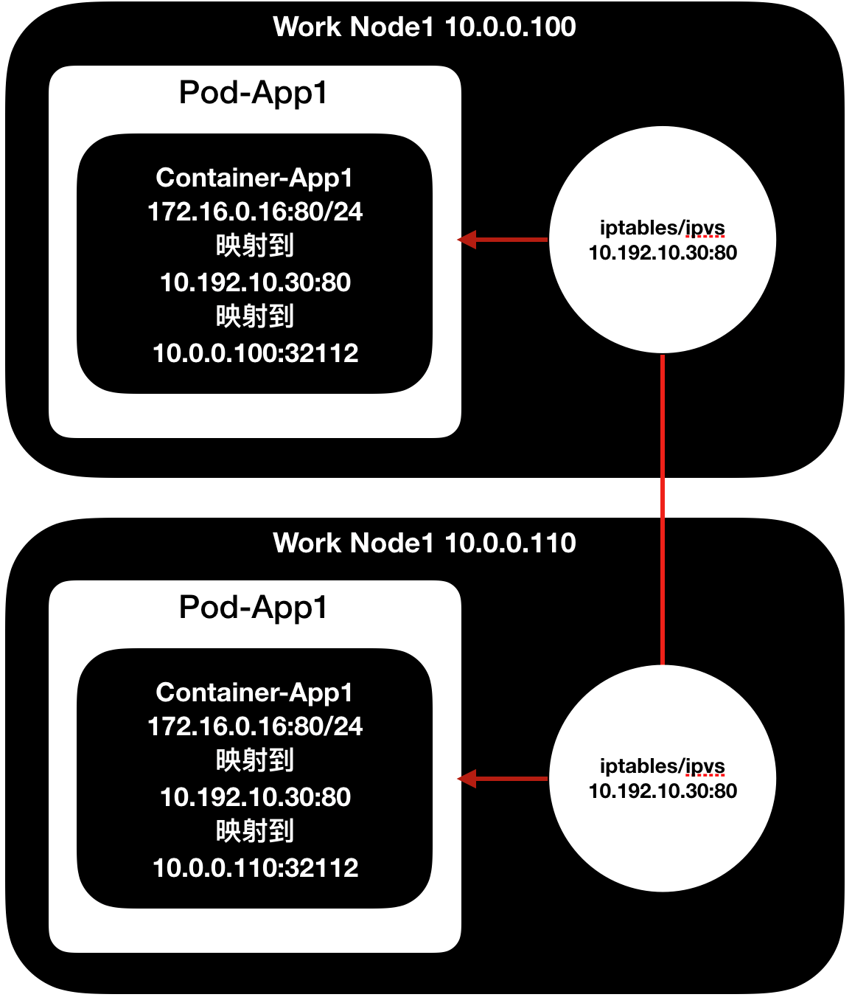

图 19.1

从上图中我们可以看到节点内部是通过 iptables（默认）或 ingress 控制器来做负载均衡的，目前默认的做法是用 iptables，但是当服务数量多达 10000 个以后，iptables 规则表会变得太过庞大导致性能下降，k8s 正在研发使用 ipvs 来代替默认节点内部的负载均衡 (netfilters/iptables)。

## Catalog

<!-- @import "[TOC]" {cmd="toc" depthFrom=1 depthTo=6 orderedList=false} -->

<!-- code_chunk_output -->

- [Kubernetes Service 服务](#kubernetes-service-%e6%9c%8d%e5%8a%a1)
  - [Catalog](#catalog)
  - [服务发布的类型](#%e6%9c%8d%e5%8a%a1%e5%8f%91%e5%b8%83%e7%9a%84%e7%b1%bb%e5%9e%8b)
    - [NodePort](#nodeport)
    - [LoadBalancer](#loadbalancer)
    - [ClusterIP](#clusterip)
    - [None](#none)
    - [Ingress（测试功能）](#ingress%e6%b5%8b%e8%af%95%e5%8a%9f%e8%83%bd)
  - [DNS](#dns)
    - [Pod](#pod)
    - [服务/Service](#%e6%9c%8d%e5%8a%a1service)
  - [实验 -- 综合练习操作 deployment](#%e5%ae%9e%e9%aa%8c----%e7%bb%bc%e5%90%88%e7%bb%83%e4%b9%a0%e6%93%8d%e4%bd%9c-deployment)
  - [实验 -- 在 k8s 上启动 odoo11](#%e5%ae%9e%e9%aa%8c----%e5%9c%a8-k8s-%e4%b8%8a%e5%90%af%e5%8a%a8-odoo11)
  - [实验 -- 部署和使用 Ingress Controller](#%e5%ae%9e%e9%aa%8c----%e9%83%a8%e7%bd%b2%e5%92%8c%e4%bd%bf%e7%94%a8-ingress-controller)
  - [实验 -- Ingress 通过子路径来访问应用](#%e5%ae%9e%e9%aa%8c----ingress-%e9%80%9a%e8%bf%87%e5%ad%90%e8%b7%af%e5%be%84%e6%9d%a5%e8%ae%bf%e9%97%ae%e5%ba%94%e7%94%a8)

<!-- /code_chunk_output -->

## 服务发布的类型

我们发布服务最终是希望在 k8s 之外的网络可以访问 Pod 提供的服务，k8s 保证了集群中 Pod 访问的负载均衡，但真实环境当中可能更加复杂，因为 k8s 可以部署在裸机上，也可以部署在云平台上的虚拟机里，那么对外提供的服务就需要云平台来提供统一的网络出口，这对 k8s 服务发布的灵活性要求很高，所以服务发布的时候会有几种选择：

### NodePort

标准 k8s 发布服务的机制，通过 iptables/ingress 来做内部的 load balance，kube-proxy 负责创建 iptalbles 的规则，节点 IP:Port(30000-32767) 先映射到 ClusterIp：Port，ClusterIp：Port 再映射到 Pod 的地址，请参阅上方的图 -- 19.1

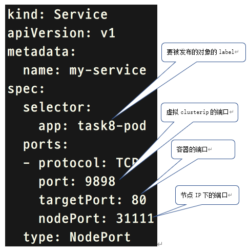

### LoadBalancer

如下图，在云平台上通过云平台的负载均衡方案来发布服务，或者叫做外部的负载均衡，外部的负载均衡器直接访问 Pod 的地址，当然根据云平台的不同会有不同的差异，比如在 OpenStack 上和 Azure 上的实现就有不同的做法，当你在发布服务的时候选择 LoadBalancer，k8s 就会去对应的云平台当中创建一个负载均衡器，如 OpenStack 中会创建一个 neutron 的负载均衡器或者 ocativia 的负载均衡。你可以查看一下链接获取更多信息：[https://kubernetes.io/docs/concepts/services-networking/service/#type-loadbalancer](https://kubernetes.io/docs/concepts/services-networking/service/#type-loadbalancer)

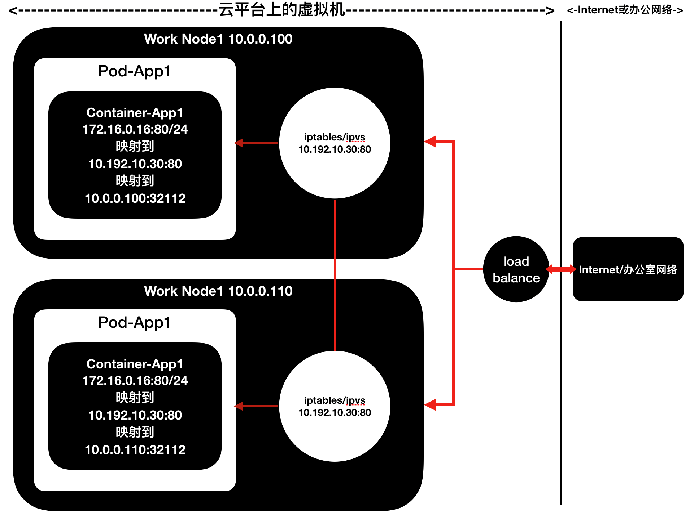

图 19.2

### ClusterIP

只将 Pod 的端口服务发布到 ClusterIp 上，节点这次不映射，换句话说 Pod 的服务无法从节点上的 Ip 加端口号来访问。

### None

又称为 headless 服务，有些服务不需要负载均衡，我们就可以通过把 spec.clusterIP 设为 None。

### Ingress（测试功能）

之前没我们通过把服务的端口暴露给节点的 ip 端口，然后对外提供服务，这里有不少弊端，比如节点的端口号不容易管理，而且不是非常灵活，如不能做基于访问路径的流量转发等，所以我们可以使用 Ingress 来做到这些，Ingress 更加灵活，目前比较常用的 Ingress 是通过 Nginx 来实现的。您可以查看这里：[https://kubernetes.io/docs/concepts/services-networking/ingress/](https://kubernetes.io/docs/concepts/services-networking/ingress/) 来了解更多的 Ingress 信息。

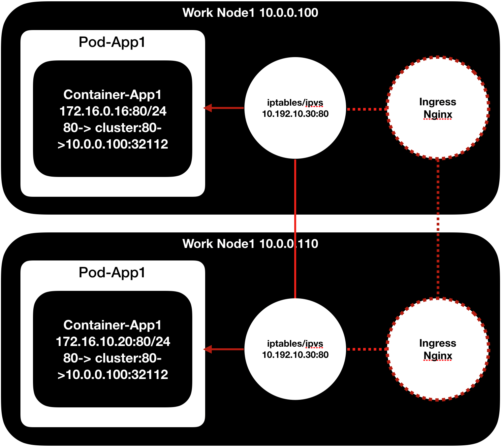

图 19.3 – Ingress

## DNS

我们在发布服务的时候经常有一种场景，有 2 个 Pod 提供服务，一个是网站的 Pod，一个是数据库的 Pod，网站的 Pod 要访问数据库的 Pod，一般我们会把 2 个 Pod 分别发布出来，所以网站的 Pod 需要访问数据库 Pod 服务的 ClusterIP, 那么就需要先发布数据库 Pod 的服务，然后在网站的 Pod 当中指定数据库 Pod 发布出来服务的 ClusterIP，这样的操作非常的繁琐，而且一旦数据库 Pod 服务的 ClusterIP 变化后就要重新设置，如果我们能通过域名访问那就方便多了，所以 k8s 提供了 DNS 的组件，它是基于 skyDNS（从 1.11 版本开始会使用 CoreDNS 来替代）来开发的。它提供 clusterIP 层面的 DNS 域名解析。

k8s 域名的规则 -- 开始之前我们需要了解 k8s 中哪些对象是有域名的，并且他们的域名是怎样组合而成的：

### Pod

Pod 的 DNS 记录遵循着 [Pod_IP].[namespace].pod.cluster.local, 比如一个 Pod 的地址是 10.0.0.30, 它运行在 default 的 namespace 下，那么它在 dns 里的记录就是 10-0-0-30.default.pod.cluster.local, 所以我们需要注意的是，你创建的 Pod 名称必须符合 dns 的命名规范，比如 my-pod 是可以的但是 my_pod 是不允许的。然后 Pod 的主机名解析默认是根据 metadata.name，比如下图的 busybox1, 当然也可以通过 spec 下的属性 hostname 来显示的指定，我们启动这个 Pod 以后 nslookup 这个 meatdata.name 或者 spec.hostname 都应该可以解析

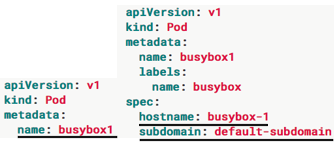

### 服务/Service

服务解析名称 (FQDN) 遵循 [服务名].[namespace].svc.cluster.local，假设一个 Pod 主机名是 postgres, 然后启动在 default 命名空间里，那么它发布出来的服务就是 postgres.default.svc. cluster.local

## 实验 -- 综合练习操作 deployment

> 实验目的：我们要使用 deployment 对象来部署 nginx 的服务，并保证 2 个 Pod 的实例，然后我们导出它的定义到一个 yaml 文件，并且删除这个 delployment，通过这个 yaml 文件重新启动一个 deployment，我们试着修改里面的配置看会发生什么，最后我们试着发布它的服务。

```shell
#我们使用 kubectl run 命令来创建一个 deployment 对象
# image 参数指定了用什么镜像
# relicas 参数指定了要启动几个相同的 Pod
# image-pull-policy 参数指定了下载镜像的规则，
# 其中 IfNotPresent 如果镜像存在就用已有的镜像，反之下载。
trystack@k8sMaster ~ $  kubectl run --image=nginx:latest --replicas=2 --image-pull-policy=IfNotPresent nginx
# 查看 Pod, 注意 scheduler 会默认尽可能不把这 2 个实例启动在同一个节点上。
trystack@k8sMaster ~ $  kubectl get pods -o wide
```

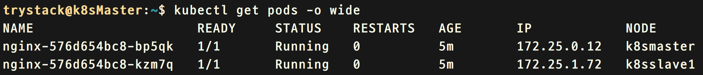

```shell
#查看 deployment 对象，注意观察 AVAILABLE 代表可用的 Pod
#deployment 会监控可用的 Pod 数量（实例数量）
#如果少于用户定义的，它就会负责通知 ReplicaSet(rs) 启动新的 Pod
trystack@k8sMaster ~ $  kubectl get deployment
```

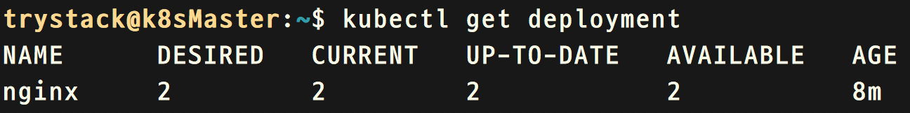

```shell
#手动强行删除 Pod，你会发现另一个 Pod 会立刻启动
trystack@k8sMaster ~ $  kubectl delete pod nginx-576d654bc8-bp5qk
#复制这个 deployment，把已经运行着的 deployment 的定义 yaml 文件导出到一个。yaml 文件
trystack@k8sMaster ~ $  kubectl get deployment nginx -o yaml > /home/trystack/course_lab/lab19-3/my_nginx.yaml
trystack@k8sMaster ~ $ vim /home/trystack/course_lab/lab19-3/my_nginx.yaml
#注意看下图，删除白色框里面的内容，注意把 status 以下，包括 status 标签一起删除，因为截图不能全显示
```

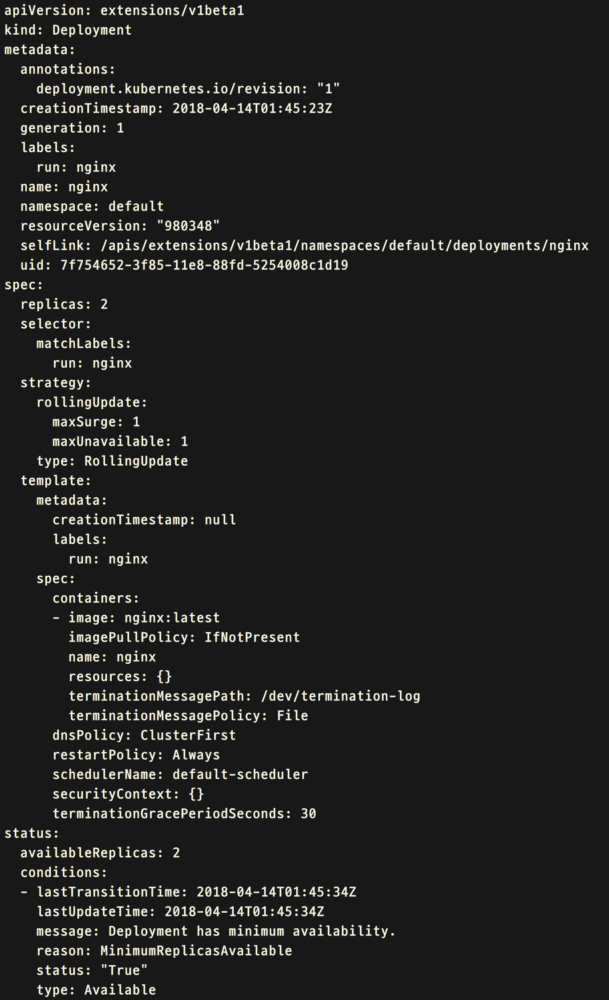

```shell
#删除现有的 deployment 对象，关联的 Pod 也会被删除
trystack@k8sMaster ~ $  kubectl delete deploy nginx
#通过我们修改的 yaml 文件重启一个 deployment 对象
trystack@k8sMaster ~ $  kubectl create -f /home/trystack/course_lab/lab19-3/my_nginx.yaml
#验证一切是否正常
trystack@k8sMaster ~ $  kubectl get pods,deploy,rs -o wide
```

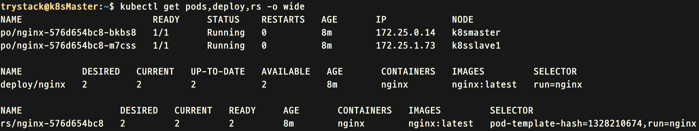

```shell
#修改 Deployment，把实例改成 3 个，利用 kubectl edit
#会打开一个 vim 进行编辑，修改 replicas 的值为 3
trystack@k8sMaster ~ $  kubectl edit deploy nginx
#然后看一下 Pod 的数量，当然你可以通过此方法修改其它对象
#但尽可能不要修改 ReplicaSet 对象，除非你很熟悉
trystack@k8sMaster ~ $  kubectl get pods
```

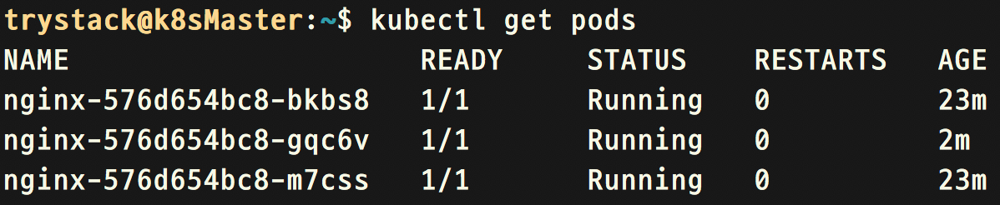

```shell
#接下去我们要演示一下更新 Deployment 和回滚的功能
#注意只有对模版的修改才会被记录为可回滚的记录，比如修改镜像，单纯修改实例的数量不会被记录
#查看 Deployment 对象的回滚历史
trystack@k8sMaster ~ $  kubectl rollout history deployment nginx
```

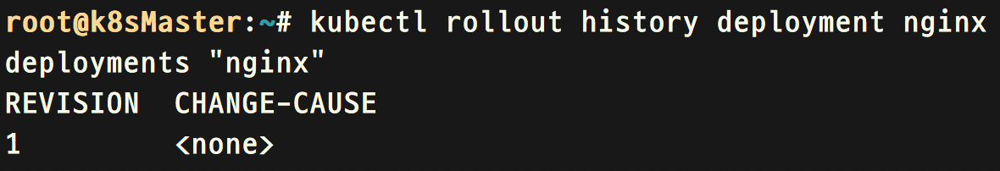

```shell
#修改镜像的使用，修改 image: nginx:latest 为 nginx:1.9.0, 然后保存
trystack@k8sMaster ~ $  kubectl edit deploy nginx
# 快速检查 Pod 你会发现，多了 1 个 Pod 出现
# 那是因为我们之前在 rollingUpdate 下的 maxSurge 设置为 1
trystack@k8sMaster ~ $  kubectl get pods
#再次查看 Deployment 对象的回滚历史
#你可以通过—record 来记录每次操作到 rollout history 当中
trystack@k8sMaster ~ $  kubectl rollout history deployment nginx
```

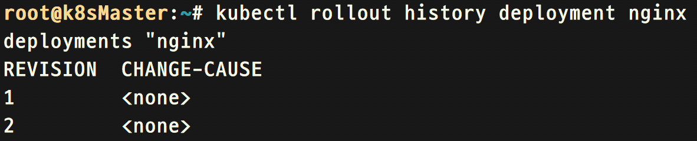

```shell
#比较下 2 者的区别，你会发现他们除了文字描述以外
#最主要的就是镜像的区别
trystack@k8sMaster ~ $  kubectl rollout history deployment nginx --revision=1 > /home/trystack/course_lab/lab19-3/revision1
trystack@k8sMaster ~ $  kubectl rollout history deployment nginx --revision=2 > /home/trystack/course_lab/lab19-3/revision2
trystack@k8sMaster ~ $  diff /home/trystack/course_lab/lab19-3/revision1 /home/trystack/course_lab/lab19-3/revision2
```

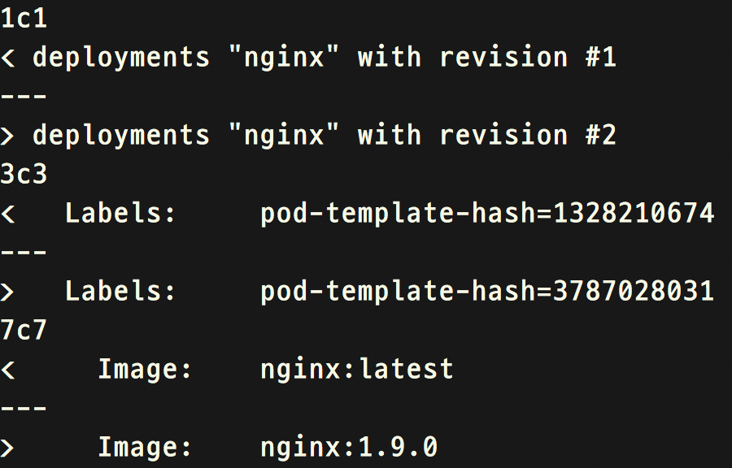

```shell
#回滚到 reviersion1
trystack@k8sMaster ~ $  kubectl rollout undo deploy/nginx --to-revision=1
#看一下 Pod 使用的镜像版本，会发现都回到了 nginx:latest
trystack@k8sMaster ~ $  kubectl get pods -o yaml | grep -i image
```

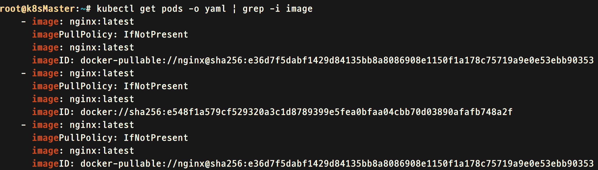

```shell
#接下去我们要把 Pod 发布为服务，为了演示目的，修改实例数
#修改 replicas 的值为 2, 然后添加容器暴露出来的端口号：
#添加白色框里的内容
trystack@k8sMaster ~ $  kubectl edit deploy nginx --record
```

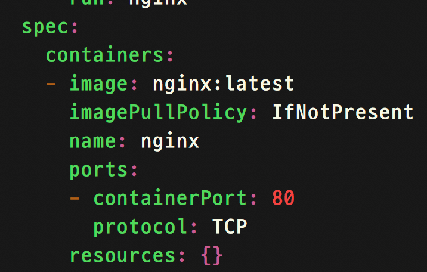

```shell
#发布服务
trystack@k8sMaster ~ $  kubectl expose deployment nginx --type=NodePort
#查看服务信息
#cluster-ip 就是 virtual ip address，俗称 vip
#endpint 就是我们 Pod 的 ip 地址
#80:32175 代表将 Pod 提供服务的 80 端口映射到 CLUSTER-IP
#然后将主机的 32175 映射到 CLUSTER-IP(10.107.232.113) 的 80
trystack@k8sMaster ~ $  kubectl get svc nginx
trystack@k8sMaster ~ $  kubectl get ep nginx
```

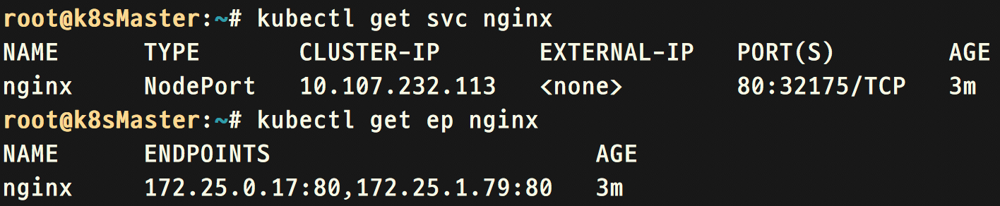

```shell
#验证 Pod 是否提供服务，你会看到很多 html 的输出
trystack@k8sMaster ~ $  curl http://172.25.0.17:80
trystack@k8sMaster ~ $  curl http://10.107.232.113:80
trystack@k8sMaster ~ $  curl http://10.0.0.100:32175
trystack@k8sMaster ~ $  curl http://10.0.0.110:32175
```

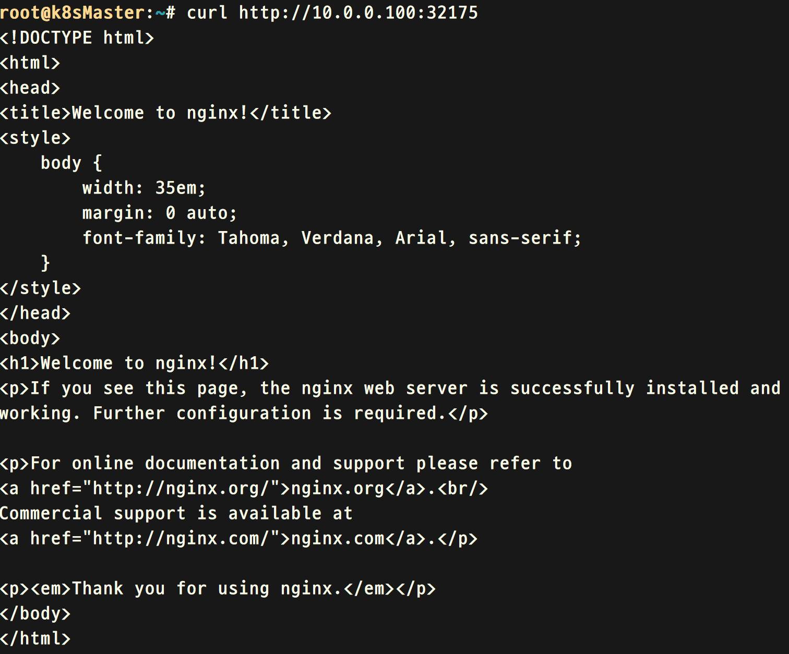

```shell
#偷窥一下 iptables 规则表
trystack@k8sMaster ~ $  sudo ipvsadm
#删除服务和 deployment
trystack@k8sMaster ~ $  kubectl delete svc/nginx
trystack@k8sMaster ~ $  kubectl delete deploy/nginx
```

## 实验 -- 在 k8s 上启动 odoo11

> 实验目的：我们将要启动一个 odoo(openERP) 应用，它需要一个 postgres 数据库和一个网站服务，所以我们需要部署一个网站的服务和一个数据库的服务 (postgres), 然后网站服务需要通过数据库服务的域名来访问数据库，数据库存放数据的存储我们使用之前练习做过的 pvc，pv。

```shell
#删除/tmp/nfs_expose/home 下的之前的文件
trystack@k8sMaster ~ $  rm /tmp/nfs_expose/home/*.* -f
#创新的 pv、pvc
trystack@k8sMaster ~ $  kubectl create -f /home/trystack/course_lab/lab18-6/nfs_pv1.yaml
trystack@k8sMaster ~ $  kubectl create -f /home/trystack/course_lab/lab18-6/nfs_pvc1.yaml
#通过 deployment 创建 postgres 数据库 Pod
trystack@k8sMaster ~ $  kubectl create -f /home/trystack/course_lab/lab19-4/postgres_pod.yaml
#发布 postgres 服务，这样后面的网站服务就可以通过域名访问了
trystack@k8sMaster ~ $  kubectl expose deploy postgres
#检查服务状态，注意白色下划线的内容
trystack@k8sMaster ~ $  kubectl get pod,svc,ep
```

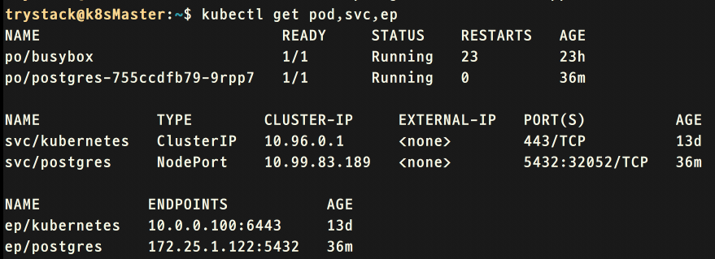

```shell
#登录容器检查 dns 名称
trystack@k8sMaster ~ $  kubectl exec -it postgres-755ccdfb79-9rpp7 /bin/bash
#在容器里安装 nslookup 工具，注意白色下划线的域名
root@postgres:/# apt update -y
root@postgres:/# apt install dnsutils -y
root@postgres:/# nslookup postgres
```

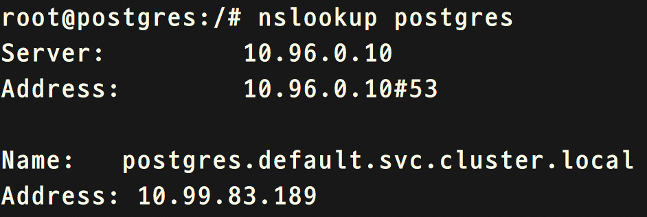

```shell
root@postgres:/# exit
#通过 deployment 创建网站服务的 Pod
trystack@k8sMaster ~ $  kubectl create -f /home/trystack/course_lab/lab19-4/odoo_pod.yaml
#发布网站服务
trystack@k8sMaster ~ $  kubectl expose deploy/odoo --type=NodePort
#检查服务状态，注意白色下划线的内容，其中 30469 端口
#可以通过集群当中任何一个节点的 ip 地址下访问此端口
trystack@k8sMaster ~ $  kubectl get svc,ep
```

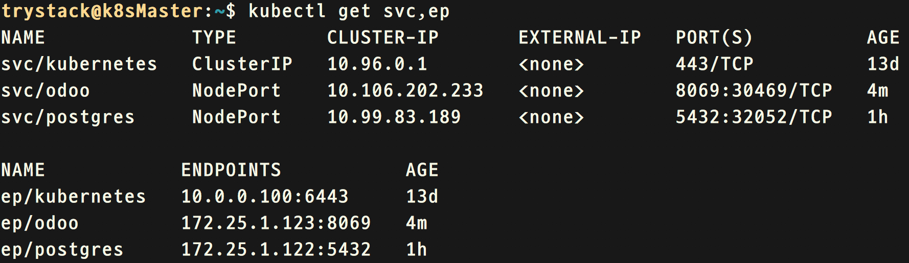

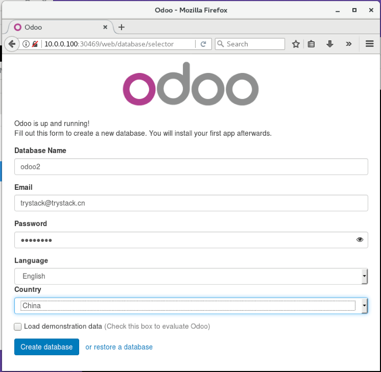

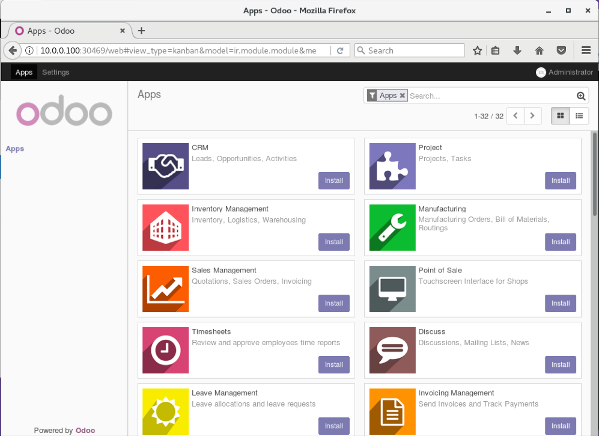

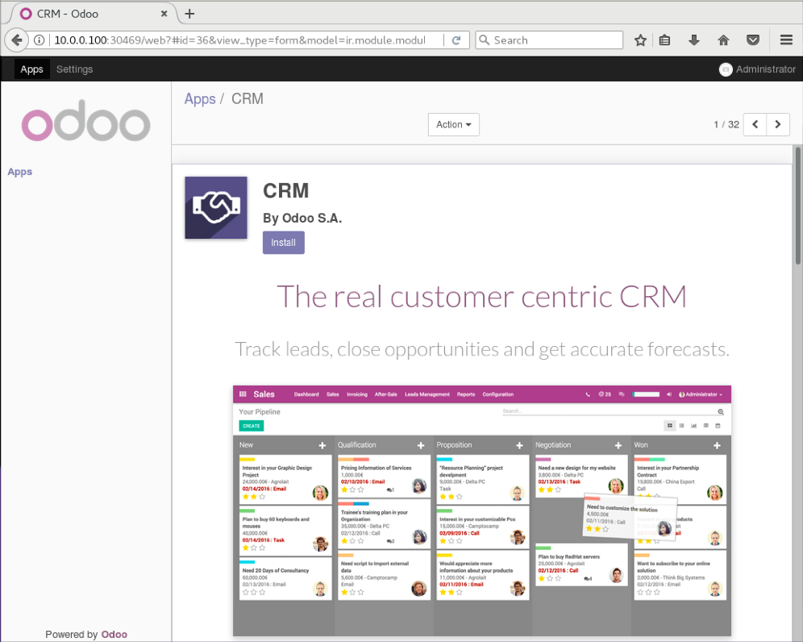

## 实验 -- 部署和使用 Ingress Controller

> 实验目的：我们之前做的练习都是基于 NodePort 来发布服务的，这样一样主机的端口号会从 30000 以后开始，一旦应用多了以后端口号的管理就不太方便了，如果在每个节点上有一个统一的组件，然后这个组件监听着一个固定的端口比如 80，然后通过主机头来转发应用的请求。这样一来既可以很好的管理端口号，又可以更灵活的对请求做管理，这个组件或者说机制就是 ingress，ingress 在实现的时候很多选择一般我们会使用 nginx 来实现，在本章的练习当中我们讲在两个节点上部署 ingress controller，它负责监听 api server 对 ingress 规则的操作，来适当的修改每个节点的 nginx 的配置文件。

```shell
#发布 ingress controller，ingress controller 需要运行在所有的工作节点 (slave/worker) 上
#当然如果 master 也可以充当工作节点，所以如果 master 也充当多个角色的时候
#ingress controller 也需要运行在 master 节点上，在我们的场景中 master 也充当工作节点
#所以我们可以使用 DaemonSet 来达到这一个目的
#在 master 节点上运行以下命令，以下命令会创建 controller 所需要的各种资源
#比如 ClusterRole、ClusterRoleBinding、Service Account、Service、Deployment 等等
#最主要的是它会启动一个 DaemonSet，保证每个节点都一个 controller 的 pod
trystack@k8sMaster ~ $  kubectl create -f /home/trystack/course_lab/lab19-5/mandatory.yaml
#检查一来的 Pod 都已经正常的启动了，如果都 running 表示一切正常
trystack@k8sMaster ~ $  kubectl get pod -n ingress-nginx
```

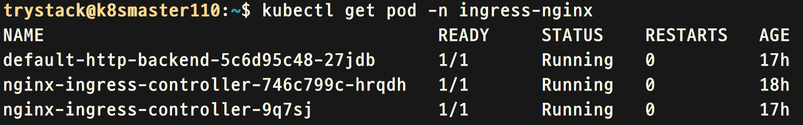

```shell
#检查 404 页面的服务 Pod 运行正常，应该显示 default backend - 404
trystack@k8sMaster ~ $  curl http://10.0.0.100
trystack@k8sMaster ~ $  curl http://10.0.0.110
#创建一个 ingress 讲 ingress 的后端绑定到上一个练习当中我们创建的 odoo 服务
trystack@k8sMaster ~ $  kubectl get svc
```

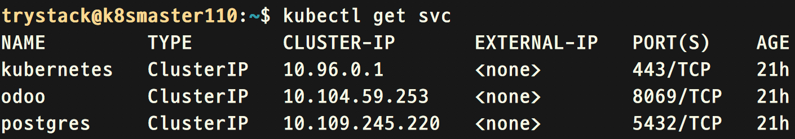

```shell
#从 yaml 文件创建 ingress，将 ingress 接到单一的服务后端只需要定义 spec 下的 backend 即可
#spec:
#    backend:
#        serviceName: odoo
#        servicePort: 8069
trystack@k8sMaster ~ $  kubectl create -f /home/trystack/course_lab/lab19-5/ingress-single-backend.yaml
#检查 ingress 的信息
trystack@k8sMaster ~ $  kubectl get ingress
```


```shell
#之后你可以打开浏览器访问 http://10.0.0.100 或者 http://10.0.0.200 来访问之前的服务
#而不需要来用 node port 的端口来访问了
#删除 ingress
trystack@k8sMaster ~ $  kubectl delete ingress odoo-ingress
```

## 实验 -- Ingress 通过子路径来访问应用

> 实验目的：我们之前了一个简单 ingress 后端挂在了一个 service，但在很多的现实场景中一个节点上会挂在多个应用，这时我们可以通过子路径来区分服务，因为我们没有 load balance 所以为了简单期间我们就用主机的/etc/hosts 文件来做域名解析了，正确的使用场景应该如下图：
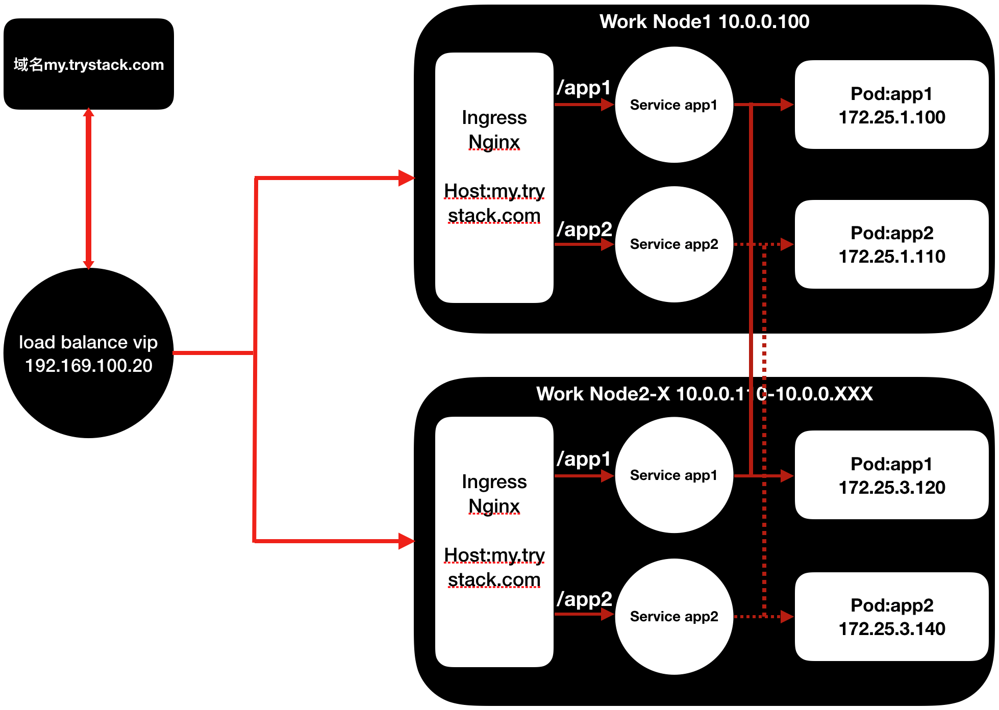

```shell
#开始之前我们需要做一些准备工作首先准备一些 pod 用来显示的页面内容
#在 master 和 slave1 节点上分别运行以下命令
trystack@k8sMaster ~ $  mkdir /tmp/app1
trystack@k8sMaster ~ $  mkdir /tmp/app2
trystack@k8sMaster ~ $  echo '<html><body>This is app1</body></html>' > /tmp/app1/index.html
trystack@k8sMaster ~ $  echo '<html><body>This is app2</body></html>' > /tmp/app2/index.html
trystack@k8sslave1 ~ $  mkdir /tmp/app1
trystack@k8sslave1 ~ $  mkdir /tmp/app2
trystack@k8sslave1 ~ $  echo '<html><body>This is app1</body></html>' > /tmp/app1/index.html
trystack@k8sslave1 ~ $  echo '<html><body>This is app2</body></html>' > /tmp/app2/index.html
#修改主机的 hosts 文件来解析域名，注意中间是 tab 键不是很多空格
root@host ~ $ echo '10.0.0.100      my.trystack.com' >> /etc/hosts
#启动 deployment 和发布服务，在 master 节点上运行
trystack@k8sMaster ~ $ kubectl create -f  /home/trystack/course_lab/lab19-6/deploy_pre.yaml
#检查服务都已经启动，注意下方的 endpoint 的地址
trystack@k8sMaster ~ $ kubectl get svc,ep
```

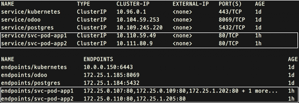

```shell
#创建 ingress
trystack@k8sMaster ~ $ kubectl create -f /home/trystack/course_lab/lab19-6/ingress_sub_path.yaml
#检验 ingress 是否工作
#显示 This is app1
root@host ~ $ curl http://my.trystack.com/app1
#显示 This is app2
root@host ~ $ curl http://my.trystack.com/app2
#检验一下 nginx 的设置，输出 master 节点上 ingress controller 的 nginx 配置
trystack@k8sMaster ~ $ kubectl get pod -n ingress-nginx -o wide
```

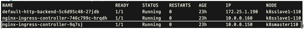

```shell
trystack@k8sMaster ~ $ kubectl get pod -n ingress-nginx -o wide
trystack@k8sMaster ~ $ kubectl exec -it nginx-ingress-controller-9q7sj cat /etc/nginx/nginx.conf -n ingress-nginx >> temp_config
#你会发现 app 虚拟路径绑定的后端是直接指向的 endpoint 的而不是 clusterip
```
