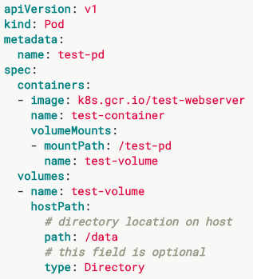
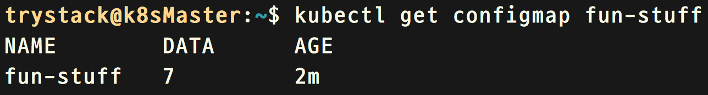
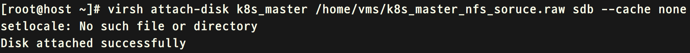

# Kubernetes 数据存储

k8s 可以通过容器引擎将数据存入到不同的存储设备中，存储的类型可以是临时的，也可以是持久化的。在持久化存储中，可以集成各种存储系统比如 ceph、NFS 等，在不久的将来 kubernetes 的存储会发生相当大的变化，请了解下 [CSI(Container Storage Interface)](https://kubernetes.io/blog/2018/01/introducing-container-storage-interface)

## Catalog

<!-- @import "[TOC]" {cmd="toc" depthFrom=1 depthTo=6 orderedList=false} -->

<!-- code_chunk_output -->

- [Kubernetes 数据存储](#kubernetes-%e6%95%b0%e6%8d%ae%e5%ad%98%e5%82%a8)
  - [Catalog](#catalog)
  - [存储类型](#%e5%ad%98%e5%82%a8%e7%b1%bb%e5%9e%8b)
    - [emptyDir](#emptydir)
    - [secret](#secret)
    - [hostPath](#hostpath)
    - [configMap](#configmap)
  - [PV 持久化存储对象](#pv-%e6%8c%81%e4%b9%85%e5%8c%96%e5%ad%98%e5%82%a8%e5%af%b9%e8%b1%a1)
    - [静态](#%e9%9d%99%e6%80%81)
    - [动态](#%e5%8a%a8%e6%80%81)
    - [PV(PersistentVolume) 对象](#pvpersistentvolume-%e5%af%b9%e8%b1%a1)
    - [PVC(PersistentVolumeClaim)对象](#pvcpersistentvolumeclaim%e5%af%b9%e8%b1%a1)
  - [Storage class](#storage-class)
  - [实验 -- 操作configMap](#%e5%ae%9e%e9%aa%8c----%e6%93%8d%e4%bd%9cconfigmap)
  - [实验 -- 操作secret](#%e5%ae%9e%e9%aa%8c----%e6%93%8d%e4%bd%9csecret)
  - [实验 -- pv、pvc绑定nfs](#%e5%ae%9e%e9%aa%8c----pvpvc%e7%bb%91%e5%ae%9anfs)

<!-- /code_chunk_output -->

## 存储类型

### emptyDir

emptyDir 是一个空的临时文件夹，当 Pod 启动在一个节点上，可以根据不同的配置从节点上创建一个文件夹映射到这个 Pod 下的所有容器中，甚至你可以将 emptyDir.medium 设置为 Memory，那样的话这个节点上的 emptyDir 都会写在内存中，但是要注意 emptyDir 在 Pod 被删除时就会一并删除，并且假设你使用内存作为 emptyDir 的后端，你需要了解一旦节点重启，这些数据将不复存在。


### secret

我们之前也有提到过，secret 是存放 service account 自动生成 token 的对象，这里的场景也是将一些敏感的数据映射到某个 Pod 中去，比如用户名和密码等。

### hostPath

是将节点的目录直接映射到 Pod 中。



### configMap

是一组数据，它映射到 Pod 中容器下的某个目录或者环境变量中，数据可以是通过 configMap 定义的，也可以是节点上的一些文本文件。


## PV 持久化存储对象

之前我们叙述了很多存储的类型和简单描述了如何使用这些存储类型，我们更多的讨论了非持久化的存储，比如 emptyDir 等，但在生产环境中我们更多需要使用持久化的存储，不同的存储使用起来的参数是各种各样的，我们如果要在 Pod 中挂载他们，势必会把 Pod 定义弄的非常复杂，所以把他们的使用参数统一起来并抽象出相同的字段是非常重要的，k8s 将存储抽象出的 2 个对象分别是：PV(PersistentVolume)、PVC(PersistentVolumeClaim)，在使用的时候分为 2 种：静态 (static)、动态 (dynamic)。

### 静态

用比较好理解的方式就是点菜，你只可以点菜单上有的菜，在这里菜就是 PV，PV 是管理员创建的存储抽象的对象，它具体代表着一个存储的设备，比如一个 PV 代表一个空间为 5G 的 nfs 磁盘，也可以是一个空间为 10G 的 Ceph RBD，那么顾客点的菜就是 PVC，一个 PVC 定义了你需要多少大小的磁盘，然后还可以定义你想要的 storage class（后面解释）。


### 动态

用比较好理解的方式就是自助餐，自助餐台上的一盆大闸蟹就是一个存储池，用户需要就可以自己去取，你可以拿一只大闸蟹和很多只大闸蟹，那么规定客人能吃几只大闸蟹就非常重要了， 我们可以通过之前的章节中的配额加上 namespace 一起来限制用户可以获得的磁盘的数量和大小，需要注意的是当你使用动态的时候，在 api-server 启动时必须在—admisson-control 参数后面加上 DefaultStorageClass


### PV(PersistentVolume) 对象

PV 对象定义了对存储后端的各种操作和使用，比如大小 (capacity)、删除后的行为 (Reclaiming)、访问模式 (accessModes):

- 删除后的行为 -- 定义了当一个 pv 被一个 pvc 绑定，pvc 被删除后这个 pv 中指定磁盘的处理方式：删除 (delete)、回收 (Reclcye)、保留 (Retain), 需要注意的是，目前只有 NFS 和 hostPath 支持 Reclcye，就是直接 rm 外面映射的目录已经过时，现在可以用 command 代替，目前支持 delete 的有 AWS EBS, GCE PD, Azure Disk, Cinder volumes  
- 访问模式 -- 一个磁盘挂载到一个 Pod 之后面临一个问题，Pod 是分散在所有 k8s 集群中的各个节点之上的，那么存储设备可能需要被一个节点访问，这里就有一个并发读写的问题，并非所有的存储设备都支持并发写，所以 k8s 在 pv 对象中定义了很多个规则，他们分别是：RWO(ReadWriteOnce) 只能挂载到一个节点上，这个节点可以读写、ROM(ReadOnlyMany) 可以挂载多个节点，但只能读取、RWM(ReadWriteMany) 可以挂载到多个节点，可以同时读取，我们可以查看这里 [https://kubernetes.io/docs/concepts/storage/persistent-volumes/#access-modes](https://kubernetes.io/docs/concepts/storage/persistent-volumes/#access-modes)

### PVC(PersistentVolumeClaim)对象

用户创建用来匹配pv的申请器，它的属性需要和pv对应起来才能匹配上。


## Storage class

我们之前提到了，用户可以在PVC里指定存储的大小和类型，比如ceph、glusterfs等，你只需要在storage class里指定它的类型，类型有很多：Glusterfs、Ceph RBD、vSphere、nfs等，但有些类型需要安装插件(额外安装程序)才能正确的和存储集成起来。比如下面这个Ceph的例子:


具体详细的storage class信息可以通过以下链接获取：[https://kubernetes.io/docs/concepts/storage/storage-classes/#ceph-rbd](https://kubernetes.io/docs/concepts/storage/storage-classes/#ceph-rbd)

## 实验 -- 操作configMap

> 实验目的：我们要在k8smaster节点上创建一些文件，并写入一些文本，然后创建一个configMap，让这个configMap来读取这些文件并加载里面的值，最后创建Pod来使用这个configMap。

```shell
#在k8smaster节点上创建一些文件并写入一些文本
trystack@k8sMaster ~ $  mkdir configMapData
trystack@k8sMaster ~ $  echo "i" > configMapData/intel
trystack@k8sMaster ~ $  echo "k" > configMapData/kubernetes
trystack@k8sMaster ~ $  echo "o" > configMapData/OpenStack
trystack@k8sMaster ~ $  echo "m" > configMapData/mesosphere
trystack@k8sMaster ~ $  echo "g" > configMapData/google
trystack@k8sMaster ~ $  echo "working on it" >> configMapData/kubernetes
trystack@k8sMaster ~ $  echo "gopher" > golang
#创建configMap，然后读取我们刚才创建的这些文件
trystack@k8sMaster ~ $  kubectl create configmap fun-stuff --from-literal=love=kubernetes --from-file=./configMapData/ --from-file=./golang

#查看configMap
trystack@k8sMaster ~ $  kubectl get configmap fun-stuff
```



```shell
#查看configMap的数据,-o代表输出的格式
trystack@k8sMaster ~ $  kubectl get configmap fun-stuff -o yaml
```


```shell
#启动一个pod
trystack@k8sMaster ~ $  kubectl create -f /home/trystack/course_lab/lab18-4/configMap_pod.yaml
#连接到一个容器中，kubectl exec是和docker exec等价的
trystack@k8sMaster ~ $  kubectl exec -it nginx /bin/bash
#我们可以看到configMap下的数据都映射到了容器里的环境变量中去了
root@nginx:/# env
root@nginx:/# exit
#删除这个Pod
trystack@k8sMaster ~ $  kubectl delete pod nginx
```


```shell
#启动一个pod,把configMap映射到容器的目录下
trystack@k8sMaster ~ $  kubectl create -f /home/trystack/course_lab/lab18-4/configMap_pod2.yaml
#连接到一个容器中
trystack@k8sMaster ~ $  kubectl exec -it nginx /bin/bash
root@nginx:/# ls /etc/funs/
```


```shell
root@nginx:/# exit
#删除这个Pod
trystack@k8sMaster ~ $  kubectl delete pod nginx
```

## 实验 -- 操作secret

> 实验目的：我们要把service-account-token的secret映射到容器中。

```shell
#查看现有的secret
trystack@k8sMaster ~ $  kubectl get secret
```


```shell
***修改配置文件/home/trystack/course_lab/lab18-5/secret_pod.yaml中的secretName为你查询到的NAME名称
#启动Pod
trystack@k8sMaster ~ $ kubectl create -f /home/trystack/course_lab/lab18-5/secret_pod.yaml
#连接到一个容器中
trystack@k8sMaster ~ $  kubectl exec -it nginx /bin/bash
root@nginx:/# ls /etc/secret-vol
```


```shell
root@nginx:/# exit
#删除这个Pod
trystack@k8sMaster ~ $  kubectl delete pod nginx
```

## 实验 -- pv、pvc绑定nfs

> 实验目的：我们首先给k8smaster节点添加一块新的磁盘，因为它是一台虚拟机，所以我们会通过libvirt来挂载新的磁盘，然后我们会在k8smaster节点上安装nfs需要的软件，并将新添加的磁盘设备暴露出来给其他节点用，然后我们会创建pv和pvc，最后我们创建Pod并且绑定这个pvc。

```shell
#使用qemu-img工具创建一个磁盘，注意请使用raw格式
#copy on write的磁盘可能造成动态分配不及时，造成没足够的空间
root@host ~ $  qemu-img create -f raw -o size=5G /home/vms/k8s_master_nfs_soruce.raw
```


```shell
#使用libvirt工具挂载这个设备到k8smaster节点，挂载到/dev/sdb
root@host ~ $  virsh attach-disk k8s_master /home/vms/k8s_master_nfs_soruce.raw sdb --cache none
```



```shell
#验证已经挂载，并格式化这个设备
trystack@k8sMaster ~ $  ls /dev/sdb
```


```xshell
trystack@k8sMaster ~ $  sudo mkfs.ext4 /dev/sdb
```


```shell
#安装nfs软件
trystack@k8sMaster ~ $  sudo apt install -y nfs-kernel-server
#创建一个文件夹作为mount点
trystack@k8sMaster ~ $  mkdir -p /tmp/nfs_expose
#修改fstab,并mount新磁盘设备到mount点
trystack@k8sMaster ~ $  sudo -s
root@k8sMaster ~ $  echo '/dev/sdb /tmp/nfs_expose        ext4    defaults        0       1' >> /etc/fstab
root@k8sMaster ~ $  mount -a
root@k8sMaster ~ $  mount | grep -i sdb
```


```shell
root@k8sMaster ~ $  mkdir /tmp/nfs_expose/home
root@k8sMaster ~ $  chmod -R 1777 /tmp/nfs_expose/
root@k8sMaster ~ $  echo 'hi' > /tmp/nfs_expose/home/sayhi
#暴露/tmp/nfs_expose/home目录
root@k8sMaster ~ $  echo '/tmp/nfs_expose/home *(rw,sync,no_root_squash,subtree_check)' >> /etc/exports
root@k8sMaster ~ $  exportfs –ra
root@k8sMaster ~ $  exit
#从k8sslave1上测试k8smaster正确暴露出了/tmp/nfs_expose/home目录
#安装测试nfs client
trystack@k8sSlave1 ~ $  sudo apt install -y nfs-common
trystack@k8sSlave1 ~ $  showmount -e 10.0.0.100
```


```shell
#测试挂载,并打印文本sayhi
trystack@k8sSlave1 ~ $  sudo mount 10.0.0.100:/tmp/nfs_expose/home /mnt
trystack@k8sSlave1 ~ $  cat /mnt/sayhi
```


```shell
#创建一个pv
trystack@k8sMaster ~ $  kubectl create -f /home/trystack/course_lab/lab18-6/nfs_pv1.yaml
#查看pv
trystack@k8sMaster ~ $  kubectl get pv
```


```shell
#创建一个pvc来匹配这个pv
trystack@k8sMaster ~ $  kubectl create -f /home/trystack/course_lab/lab18-6/nfs_pvc1.yaml
#查看pvc,注意状态是Bound，并且是nfs-pv1
trystack@k8sMaster ~ $  kubectl get pvc
```


```shell
#创建一个Pod来绑定这个pvc
trystack@k8sMaster ~ $  kubectl create -f /home/trystack/course_lab/lab18-6/nfs_pod.yaml
#连接到一个容器中
trystack@k8sMaster ~ $ kubectl exec -it nginx /bin/bash
root@nginx:/# cat /opt/sayhi
```


```shell
root@nginx:/# echo 'hi from container' > /opt/container_says_hi
root@nginx:/# exit
trystack@k8sMaster ~ $  cat /tmp/nfs_expose/home/container_says_hi
```


```shell
#删除Pod和pvc，你会发现并没有删除这个文件
#因为Recycle已经过时(deprecated)，你可以用command代替
# https://kubernetes.io/docs/concepts/storage/persistent-volumes/#recycle
trystack@k8sMaster ~ $  kubectl delete pod nginx
trystack@k8sMaster ~ $  kubectl delete pvc mypvc1
trystack@k8sMaster ~ $  cat /tmp/nfs_expose/home/container_says_hi
trystack@k8sMaster ~ $  kubectl delete pv nfs-pv1
```
